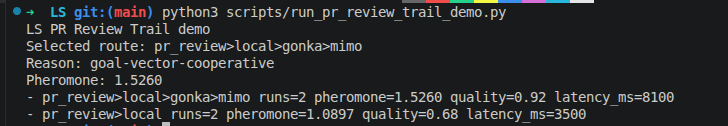

# LS — Cooperative Precision Layer for AI Co-work

[English](#english) | [Русский](#russian)

> **LS v0.1 is an evidence-backed Change Intelligence Gate for AI-generated pull requests.** It freezes the exact PR head, distinguishes `PASS` from `NOT_RUN`, combines deterministic and independent AI review evidence, adjudicates findings, and emits a verdict a person can verify.
>
> **LS v0.1 — доказательный Change Intelligence Gate для AI-generated PR.** Он фиксирует точный SHA, не превращает непройденную проверку в успех, сводит findings с фактами и показывает понятный итог.
>
> [Read the LS v0.1 Product Scorecard](docs/LS_V0_1_PRODUCT_SCORECARD.md) · Two external proofs: Robys causal closure and ibex reviewer-gate risk detection.

---

<a name="english"></a>

# LS — Cooperative Precision Layer for AI Co-work

[](https://github.com/safal207/LS/actions/workflows/web4_runtime_ci.yml)
[](https://github.com/safal207/LS/actions/workflows/council_safety.yml)
[](https://github.com/safal207/LS/actions/workflows/cognitive_trail_contract.yml)
[](https://github.com/safal207/LS/actions/workflows/pages.yml)
[](#quick-start)
[](https://ollama.com/)
[](LICENSE)
[](#core-architecture-summary)

Live site: [GitHub Pages](https://safal207.github.io/LS/)
Community: [Roadmap](ROADMAP.md) · [Task board](docs/COMMUNITY_TASKS.md) · [Cognitive Trail tasks](docs/COGNITIVE_TRAIL_CONTRIBUTOR_TASKS.md) · [Contributing](CONTRIBUTING.md)
Reviewer ecosystem: [Ecosystem Reviewer Index](docs/ECOSYSTEM_REVIEWER_INDEX.md)
Cooperative precision: [Evidence Snapshot](docs/COGNITIVE_TRAIL_EVIDENCE_SNAPSHOT.md) · [Reviewer Quickstart](docs/COGNITIVE_TRAIL_REVIEWER_QUICKSTART.md) · [Contributor Tasks](docs/COGNITIVE_TRAIL_CONTRIBUTOR_TASKS.md) · [Benchmark Note](docs/COGNITIVE_TRAIL_PR_REVIEW_BENCHMARK_NOTE.md) · [Metrics](docs/COOPERATIVE_PRECISION_METRICS.md) · [Precision Stack](docs/COOPERATIVE_PRECISION_STACK.md) · [Network Precision Gain](docs/NETWORK_PRECISION_GAIN.md) · [Stability Probe](docs/COOPERATIVE_PRECISION_METRICS.md#nash-style-route-stability) · [Stability Sample](examples/route-stability/nash_route_stability_sample.json) · [Stability Contract](docs/ROUTE_STABILITY_SAMPLE_CONTRACT.md) · [Stability Evidence Map](docs/ROUTE_STABILITY_EVIDENCE_MAP.md) · [Roadmap](docs/COOPERATIVE_PRECISION_ROADMAP.md) · [Cognitive Trail Network](docs/COGNITIVE_TRAIL_NETWORK.md) · [PR Role Market Benchmark](docs/PR_ROLE_MARKET_BENCHMARK.md)
Contributor calls: [Network Precision Contributor Call](docs/NETWORK_PRECISION_CONTRIBUTOR_CALL.md) · [IDE Testing Entrypoints](docs/IDE_TESTING_ENTRYPOINTS.md) · [Route Stability Contributor Runs](docs/ROUTE_STABILITY_CONTRIBUTOR_RUNS.md) · [Issue #563 contributor matrix](https://github.com/safal207/LS/issues/563)
Meta-interaction: [Depth Economy Layer](docs/DEPTH_ECONOMY_LAYER.md) · [Amygdala Layer Map](docs/AMYGDALA_LAYER_MAP.md) · [Model Roster Depth Probe](docs/MODEL_ROSTER_DEPTH_PROBE.md)
MCP bridge: [LS Trail MCP Server v0.2](docs/LS_TRAIL_MCP_SERVER.md)
Positioning: [Project Positioning](docs/PROJECT_POSITIONING.md)
New here? Start with: [Why Star LS](docs/WHY_STAR_LS.md) · [Architecture map](docs/architecture-map.md) · [Roadmap](docs/roadmap.md) · [2-minute route-stability demo](#2-minute-route-stability-demo)

**LS is a local-first cooperative precision layer for human-plus-model work.**
It does not make models magically smarter. It makes repeated cooperation more
precise by checking continuity, evidence, consent, routes, and contributions
before outputs become actions, memory, or reputation.

## LS in 3 minutes

### What LS is

LS is an architecture for **continuity-aware, identity-aware AI work**.

It sits above raw model outputs and turns them into governed artifacts:

- reviewed route decisions;
- evidence-bearing trail records;
- durable memory candidates;
- governed identity updates;
- human-reviewable current state.

In short:

```text
raw AI work -> evidence -> governance -> durable memory / identity state
```

### Why LS exists

Most AI systems can produce answers, but they usually do not separate:

- a single event from a repeated pattern,
- a repeated pattern from a proposed identity change,
- a proposed identity change from an approved one,
- an approved change from the current reconstructed identity state,
- and all of that from human review.

LS exists to make those boundaries explicit and auditable.

## LS Conformance Catalog

LS also acts as a **conformance and continuity framework** for agent runtimes, memory systems, governance layers, and external clients.

The goal of the conformance catalog is not to require adoption of LS as a whole. The goal is to provide small, portable fixture families that capture recurring failure modes and invariants across real agent ecosystems.

### What the catalog covers

The current conformance work focuses on failures such as:

- missed terminal events and bounded client reconciliation;
- durable memory being mistaken for spendable authority;
- constrained tool calls reaching upstream without a valid credential;
- pending approval being collapsed into missing approval;
- incomplete record sets being treated as complete authority.

### Read these first

The current flagship fixture families live in [`ls-conformance/`](ls-conformance/README.md):

1. [`missed_terminal_event_reconciliation`](ls-conformance/missed_terminal_event_reconciliation/README.md)
2. [`durable_memory_not_authority`](ls-conformance/durable_memory_not_authority/README.md)
3. [`credential_bound_tool_authority`](ls-conformance/credential_bound_tool_authority/README.md)

Each fixture family includes:

- a short problem statement;
- the core invariant;
- accept vectors;
- reject vectors;
- a minimal machine-readable schema.

### Canonical vocabulary for the conformance layer

| Term | Meaning |
| --- | --- |
| **Authority** | spendable permission to act |
| **Memory** | durable recallable context, not permission |
| **Receipt** | audit evidence |
| **Credential** | spendable enforcement material |
| **Phase** | lifecycle-bound validity window |
| **Seal** | proof that a record set is terminally complete |
| **Reconciliation** | bounded recovery after missed or partial observation |

Canonical pack issue: [LS Conformance Pack v0.1 #757](https://github.com/safal207/LS/issues/757)

### The current LS identity chain

The repo now contains a full continuity / identity / review path:

```text
VerifiedEpisode
  -> TrackAggregationRecord
  -> IdentityProposalCandidate
  -> GovernanceDecision
  -> IdentityUpdateRecord
  -> RollbackLedger
  -> IdentitySnapshot
  -> Identity Dashboard
  -> IdentityReviewAction
```

This means LS can model:

1. **what happened** (`VerifiedEpisode`)
2. **what repeated enough to become a pattern** (`TrackAggregationRecord`)
3. **what may change identity** (`IdentityProposalCandidate`)
4. **what governance approved or rejected** (`GovernanceDecision`)
5. **what identity change actually became durable** (`IdentityUpdateRecord`)
6. **what was later rolled back or superseded** (`RollbackLedger`)
7. **who the agent is right now** (`IdentitySnapshot`)
8. **how a human can inspect and challenge that state** (`Identity Dashboard` / `IdentityReviewAction`)

### Where to start reading

If you want the shortest path through the architecture, read in this order:

1. [`docs/architecture-map.md`](docs/architecture-map.md)
2. [`docs/identity-snapshot.md`](docs/identity-snapshot.md)
3. [`docs/snapshot-reconstruction.md`](docs/snapshot-reconstruction.md)
4. [`docs/identity-dashboard.md`](docs/identity-dashboard.md)
5. [`docs/human-review-workflow.md`](docs/human-review-workflow.md)
6. [`docs/roadmap.md`](docs/roadmap.md)
7. [`ls-conformance/README.md`](ls-conformance/README.md)

### Current status of the identity architecture

Completed blocks:

- **#710** — continuity coordinator / aggregation / thresholds
- **#717** — identity proposal candidate / governance handoff
- **#721** — identity update record / rollback ledger
- **#727** — identity snapshot reconstruction
- **#742** — identity dashboard / human review surface

The repo also contains parallel LS directions around cooperative precision, PR review trails, route stability, and the personal cognitive garden. The new architecture map and roadmap make it easier to see how those threads connect.

## First 10 seconds

LS is for people who use AI heavily and do not want useful sessions to vanish
inside chat history.

It turns an AI session into a reviewed update: a goal, skill, decision,
evidence item, or growth path. Nothing becomes durable personal memory until a
human accepts it.

The core loop:

```text
task -> route -> evidence -> contribution -> decision -> reusable artifact
```

### Skills vs LS Network

Skills are useful instructions for one agent. LS Network is the accumulated
experience of routes: memory, metrics, evidence, and contributor signals.

| Skills | LS Network |
| --- | --- |
| static instruction | accumulated experience |
| helps one agent act | helps the network choose a route |
| says how to do the task | measures what actually worked |
| usually does not know who contributed | scores role and actor contribution |
| may skip result verification | requires evidence, trace, and route score |
| lives inside an agent | connects Codex, OpenCode, Cursor, and models through MCP |

Short version:

```text
skill = instruction
LS Network = verified route experience
```

First wedge: **AI Code Review / PR Review Trail Network**. A real git diff can
be routed through draft review, risk critique, evidence verification, and final
summary, then saved as a reusable trail artifact.

LS also contains a **Personal Cognitive Garden** direction: useful AI sessions
can become human-owned development memory, but only with evidence and human
review. The system must grow skill capital without becoming surveillance.

### 2-minute route-stability demo

```bash
python -m pip install jsonschema pytest
PYTHONPATH=.:python:python/modules python -m pytest python/tests/test_nash_route_stability.py
python scripts/run_nash_route_stability_demo.py --json
```

This checks the current route-stability evidence chain:

```text
schema
-> checked-in sample
-> negative fixtures
-> deterministic probe
-> regression test
-> explicit non-claims
```

Want to help? Try the [network precision contributor call](docs/NETWORK_PRECISION_CONTRIBUTOR_CALL.md): run the same bounded probe on your OS, model runtime, and hardware. You can also join the [route-stability contributor matrix](https://github.com/safal207/LS/issues/563).

Fastest IDE path: in VS Code or Cursor, run **Terminal -> Run Task... -> LS: Prepare Contributor Report** and paste the generated Markdown report into the contributor issue. In OpenCode, run `/ls-precision-report your-github-handle` from the repository.

Run the PR-review trail demo:

```bash
python3 scripts/run_pr_review_trail_demo.py
```
## PR review trail demo screenshot

Example output from the PR review trail demo command.



Build a real PR-review trail artifact from the latest git commit:

```bash
python3 scripts/run_pr_review_trail_artifact.py
```

Build a free-only PR-review route packet for Codex, local models, or human review:

```bash
python3 scripts/run_free_pr_review_route.py
```

Run the Cooperative Role Market demo:

```bash
python3 scripts/run_role_market_demo.py
```

Score cooperative roles over a real PR-style git diff:

```bash
python3 scripts/run_pr_role_market_demo.py
python3 scripts/run_pr_role_market_demo.py --role-outputs docs/examples/pr_role_outputs.sample.json
python3 scripts/run_pr_role_market_batch.py --last 10
```

Run the Nash-style route stability probe:

```bash
python3 scripts/run_nash_route_stability_demo.py
```

Checked-in stability sample:

```text
examples/route-stability/nash_route_stability_sample.json
```

Boundary: this is a route-stability proxy, not a formal proof of Nash equilibrium.

Reviewer quickstart for Cognitive Trail validation:

```bash
python3 scripts/validate_cognitive_trail_runs.py
python3 scripts/generate_pr_review_trail_run.py --last 10 --validate
```

See: [`docs/COGNITIVE_TRAIL_EVIDENCE_SNAPSHOT.md`](docs/COGNITIVE_TRAIL_EVIDENCE_SNAPSHOT.md)
Reviewer quickstart: [`docs/COGNITIVE_TRAIL_REVIEWER_QUICKSTART.md`](docs/COGNITIVE_TRAIL_REVIEWER_QUICKSTART.md)
Benchmark note: [`docs/COGNITIVE_TRAIL_PR_REVIEW_BENCHMARK_NOTE.md`](docs/COGNITIVE_TRAIL_PR_REVIEW_BENCHMARK_NOTE.md)
Cooperative metrics: [`docs/COOPERATIVE_PRECISION_METRICS.md`](docs/COOPERATIVE_PRECISION_METRICS.md)
Stability sample: [`examples/route-stability/nash_route_stability_sample.json`](examples/route-stability/nash_route_stability_sample.json)
Stability contract: [`docs/ROUTE_STABILITY_SAMPLE_CONTRACT.md`](docs/ROUTE_STABILITY_SAMPLE_CONTRACT.md)
Stability evidence map: [`docs/ROUTE_STABILITY_EVIDENCE_MAP.md`](docs/ROUTE_STABILITY_EVIDENCE_MAP.md)
Contributor tasks: [`docs/COGNITIVE_TRAIL_CONTRIBUTOR_TASKS.md`](docs/COGNITIVE_TRAIL_CONTRIBUTOR_TASKS.md)

---

## Personal AI Operating Layer

LS can be used as a layer *above* agents, not just as another agent:

- connect different agents while keeping one center of memory, tone, and quality;
- shape, repair, hold, or escalate raw outputs before they become action;
- preserve personal context across models, tools, and sessions;
- use coordination, relational, and harmonic diagnostics to catch weak or misaligned output early.

Short version:

> do not use agents as-is; run them through your own system so they work in your logic, your rhythm, and your quality.

Personal growth direction:

> Every AI session should compound into human development.

Run the local Personal Cognitive Garden demo:

```bash
python3 scripts/run_personal_cognitive_garden_demo.py
python3 scripts/run_personal_cognitive_garden_demo.py --json
```

New contributors can use the focused PCG quick start:

- [`docs/PERSONAL_COGNITIVE_GARDEN_QUICK_START.md`](docs/PERSONAL_COGNITIVE_GARDEN_QUICK_START.md)

See a compact before/after example:

- [`docs/PERSONAL_COGNITIVE_GARDEN_GATEWAY_BEFORE_AFTER.md`](docs/PERSONAL_COGNITIVE_GARDEN_GATEWAY_BEFORE_AFTER.md)
- [`examples/personal_cognitive_garden/gateway_to_garden_before_after.json`](examples/personal_cognitive_garden/gateway_to_garden_before_after.json)

Run the Codex plugin demo:

- [`docs/CODEX_PLUGIN_DEMO.md`](docs/CODEX_PLUGIN_DEMO.md)

Safety boundary:

> LS must grow human-owned skill capital without becoming a corporate surveillance layer.

See the red-team scenario:

- [`docs/PERSONAL_COGNITIVE_GARDEN_RED_TEAM.md`](docs/PERSONAL_COGNITIVE_GARDEN_RED_TEAM.md)

## Architecture map

The fastest overview of the current LS architecture lives here:

- [`docs/architecture-map.md`](docs/architecture-map.md)

It shows how the main LS surfaces connect:

- cognitive trail / review / evidence pipeline
- personal cognitive garden
- identity continuity stack
- MCP bridge and plugin surface
- route stability and cooperative precision metrics
- near-term roadmap blocks

If you are new to the repo, start there first.

## Quick start

Requirements:

- Python 3.9+
- optional local LLM runtime (for some demos)

Install dependencies:

```bash
python3 -m pip install -r requirements.txt
```

Run the demo:

```bash
python3 scripts/run_demo.py
```

This will:

1. create a small task,
2. run it through LS,
3. produce a reusable trail artifact.

## How LS differs from a memory wrapper

LS is not just “save conversations and retrieve them later”.

LS adds:

- route-level evidence and review;
- contributor and role scoring;
- explicit approval / rejection / rollback structures;
- governed durable memory;
- continuity-aware identity updates;
- reusable trail artifacts.

## Core architecture summary

LS is currently organized around several connected layers:

- **Trail / review layer** — capture work, critiques, evidence, and outputs.
- **Governance layer** — decide what becomes durable or blocked.
- **Identity layer** — accumulate durable changes into a coherent current state.
- **Precision / metrics layer** — score route quality and cooperative performance.
- **Personal layer** — turn sessions into human-owned growth memory.

## Roadmap

See:

- [`docs/roadmap.md`](docs/roadmap.md)
- [`ROADMAP.md`](ROADMAP.md)

## Contributing

See:

- [`CONTRIBUTING.md`](CONTRIBUTING.md)

---

<a name="russian"></a>

# LS — Кооперативный слой точности для совместной работы человека и ИИ

> Русская секция репозитория будет постепенно синхронизироваться с английской по мере стабилизации архитектуры.

Сейчас лучший вход в проект:

- [`docs/architecture-map.md`](docs/architecture-map.md)
- [`docs/roadmap.md`](docs/roadmap.md)
- [`ls-conformance/README.md`](ls-conformance/README.md)
- [`docs/PERSONAL_COGNITIVE_GARDEN_QUICK_START.md`](docs/PERSONAL_COGNITIVE_GARDEN_QUICK_START.md)

Коротко:

LS — это слой над агентами и моделями, который помогает превращать сырые ответы в проверяемые, управляемые и накапливаемые артефакты: следы работы, решения, память, обновления идентичности и личный рост.

Он нужен, чтобы разделять:

- событие и устойчивый паттерн,
- память и разрешение действовать,
- предложение об изменении и одобренное изменение,
- текущую идентичность и историю её формирования,
- полезную автоматизацию и потерю человеческого контроля.
