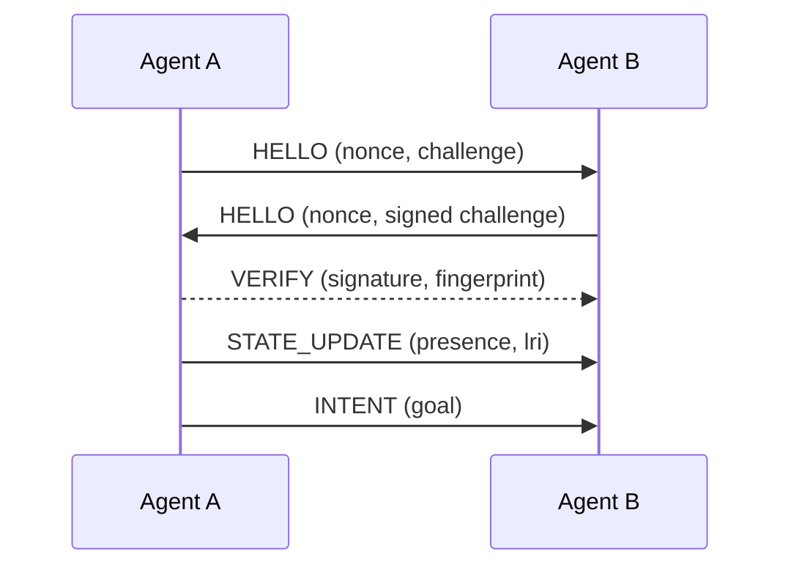
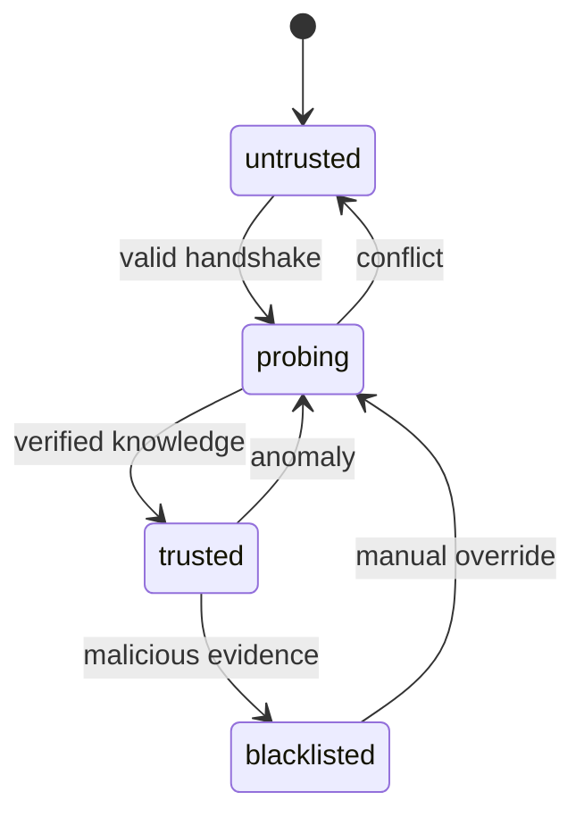
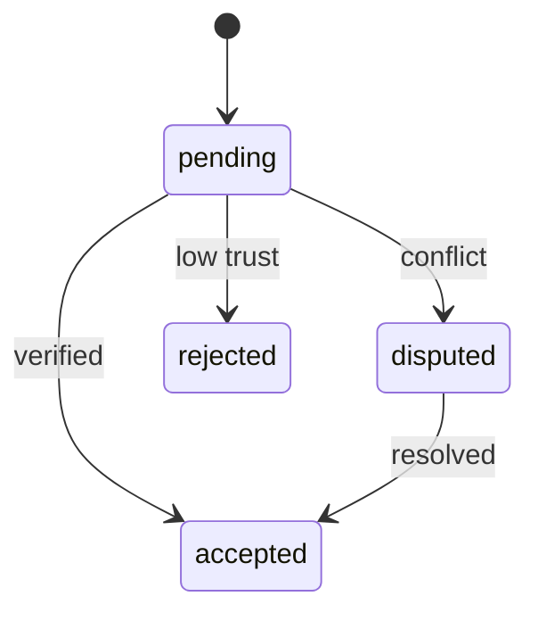

# Web4 Architecture Diagrams (Mermaid)

## 1. Protocol stack
```mermaid
flowchart TB
  Human((Human)) -->|HCP| AgentA[Agent (Python Cognition)]
  AgentA -->|CIP| AgentB[Agent (Python Cognition)]
  AgentA -.->|LIP| Internet[(Open Internet)]
  AgentA -->|RTT| RustTransport[Secure Rust Transport]
  RustTransport <--> Mesh[Mesh / P2P Network]
```

## 2. CIP handshake


## 3. Trust FSM


## 4. LIP deferred acceptance

