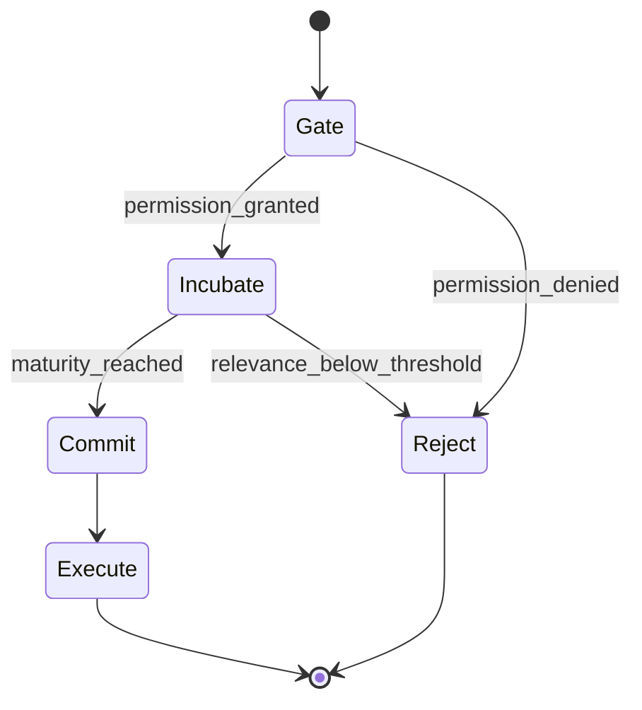
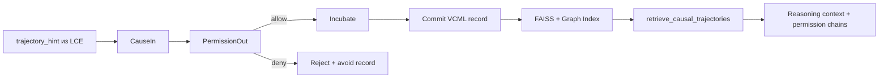
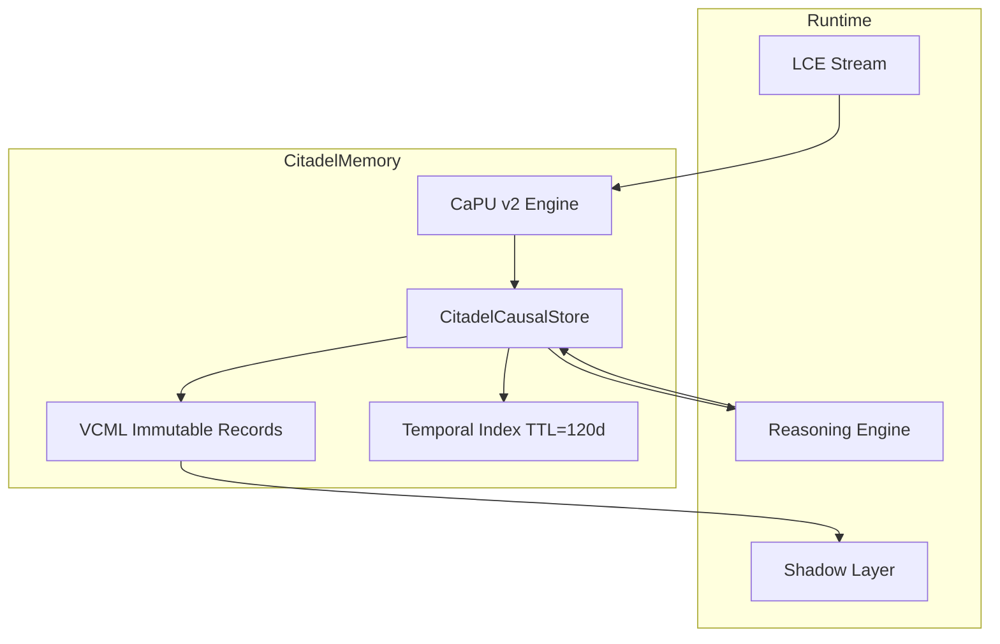

# ТЗ-2.3: Citadel Causal Memory Layer — Final

## Changelog
| Версия | Дата       | Изменения |
|--------|------------|-----------|
| 2.3    | 20.02.2026 | Финальный polish: унификация Acceptance Criteria, улучшение читаемости |
| 2.2    | 19.02.2026 | Полная интеграция CaPU + VCML, Mermaid-диаграммы |
| 2.1    | 19.02.2026 | Базовая версия Citadel Memory Layer |

## Метаданные
- **Проект:** Укрепление фундамента памяти Hexagon Core
- **Стадия:** ТЗ-2.2 → ТЗ-2.3 «Final»
- **Версия:** 2.3
- **Дата:** 20 февраля 2026
- **Автор:** Главный Архитектор
- **Статус:** Production-ready к передаче в Codex Agent

## Glossary (обязательно к пониманию)
- **CaPU** — Causal Processing Unit (permission-first state machine)
- **VCML** — Verifiable Causal Memory Layer (immutable causal records с permission_chain и responsibility)
- **Causal Maturation** — процесс Incubate, при котором траектория «созревает» до применимости
- **Permission-first** — принцип: ни одна траектория не попадает в память без прохождения Gate

## Цель
Реализовать долгосрочную **causal trajectory memory** уровня production-grade causal AI 2026 года:
- хранение не только исходов, но и причин разрешения изменений;
- фиксация стадии созревания решений;
- строгая causal accountability.

Ожидаемые эффекты:
- ускорение обучения ≥ 40 %;
- полное устранение повторных causal-ошибок;
- explainable reflection через верифицируемые VCML records.

## Архитектурные принципы (обязательные)
### 1. Permission-first (CaPU)
Каждая trajectory проходит lifecycle `Gate → Incubate → Commit → Execute → Reject`.

### 2. Verifiable Causal Records (VCML)
Immutable история intent, permission chains и ответственности.

### 3. Hierarchical Causal Storage
- short-term: in-memory (последние 100 trajectories);
- long-term: vector + graph index в VCML.

### 4. Adaptive Forgetting + Causal Maturation
Trajectory с relevance < 0.18 понижается по весу/удаляется после incubation period.

### 5. Causal Accountability
Обязательные поля: reason, permission_chain, responsibility_id.

### 6. Zero-downtime + Thread-safety + ACID

## Исходные материалы
- `data/caPU_v2/`
- `data/AdaptiveBrain/`
- `python/modules/hexagon_core/trajectory/`
- `python/modules/hexagon_core/retrospective/`
- `docs/LCE_IN_LS.md` (trajectory_hint)
- `docs/BOOTSTRAPPING_MECHANISM.md`
- `docs/MERIT_LEDGER_CONSENSUS.md`
- https://github.com/safal207/CaPU
- https://github.com/safal207/Causal-Memory-Layer/tree/main/vcml

## Требования к реализации

### 1) Новый модуль Citadel Causal Memory Layer
Создать пакет: `python/modules/hexagon_core/citadel_memory/`.
Ключевой класс: `CitadelCausalStore` — интеграция CaPU state machine + VCML storage.

### 2) Causal Trajectory Lifecycle (CaPU)
Каждая `trajectory_hint` из LCE проходит:
- `Gate` — валидация causal integrity и permissions;
- `Incubate` — maturation по времени/условиям relevance;
- `Commit` — фиксация в VCML record;
- `Execute` — использование в reasoning/few-shot;
- `Reject` — запись avoid с причиной.

Интеграция через CaPU ports: `CauseIn → PermissionOut → TraceOut`.

### 3) Хранение в VCML формате
Каноническая структура записи:
```json
{
  "vCML_id": "...",
  "cause": "...",
  "intent_vector": [0.0],
  "meaning_vector": [0.0],
  "permission_chain": ["..."],
  "responsibility": "...",
  "success_score": 0.0,
  "lessons": ["..."],
  "trace_events": ["..."],
  "timestamp": "2026-02-20T00:00:00Z"
}
```

Поиск: FAISS + causal graph similarity (cosine + graph distance).
Experience replay: `top-k=6` по causal relevance ≥ 0.75 + приоритизация по permission maturity.

### 4) Adaptive Learning Engine (CaPU + AdaptiveBrain)
Обновление весов после эпизода:
`new_weight = old × 0.82 + success_delta × 0.18`

Требования:
- `lessons` преобразуются в Shadow Layer rules + VCML permission rules;
- incubation period обновляет relevance с учётом `NetworkEffectBonus`.

### 5) Интеграция с LCE и Temporal Index
- При новом LCE: `caPU.process(trajectory_hint)` → сохранение в VCML.
- При reasoning: `retrieve_causal_trajectories(current_intent, k=5)` возвращает successful traces + permission chains.
- `trajectory_hint` включается в Temporal Index как VCML-first citizen с TTL 120 дней.

## Нефункциональные требования
- Latency чтения < 30 мс (p95) при 15 000 VCML records.
- Запись < 10 мс (ACID через CaPU Commit).
- Падение производительности Hexagon Core ≤ 5 %.
- Persistent storage: LevelDB + SQLite (VCML schema) + опционально S3.
- Полная thread-safety + T-Trace совместимость.

## Тестовое покрытие
- 18+ unit-тестов (state transitions CaPU + VCML validation).
- 4 интеграционных сценария:
  1. Полный lifecycle trajectory (`Gate → Commit`).
  2. Предотвращение повторной ошибки по VCML permission_chain (≥ 97 %).
  3. Ускорение обучения ≥ 40 % после 5 итераций.
  4. Causal accountability audit через `TraceOut` replay.
- Coverage ≥ 94 % для `citadel_memory`.

## Acceptance Criteria
- [ ] Каждая trajectory проходит CaPU lifecycle и сохраняется в VCML.
- [ ] Causal relevance retrieval ≥ 0.75 на 3 реальных сценариях из docs/.
- [ ] Повторные causal-ошибки снижены ≥ 40 %.
- [ ] Shadow Layer использует VCML lessons + permissions в 100 % рефлексий.
- [ ] Падение производительности Core ≤ 5 % (benchmark до/после).
- [ ] Все тесты зелёные + CI job `test_citadel_causal`.
- [ ] Документация: README + 3 Mermaid-диаграммы.

## Mermaid-диаграмма 1: CaPU lifecycle


## Mermaid-диаграмма 2: VCML flow


## Mermaid-диаграмма 3: Интеграция в Hexagon Core


## Риски и mitigation
- **Риск:** latency из-за state machine → **Mitigation:** cache mature trajectories + Rust bindings (день 6).
- **Риск:** несовместимость форматов → **Mitigation:** мигратор CaPU → VCML на старте.

## Оценка усилий
- 6–8 рабочих дней.
- Распределение: Python ~75 %, Rust 1–2 дня (CaPU bindings + FAISS).
- Критичный путь: дни 1–3 (CaPU integration + VCML storage).

## Зависимости и следующий этап
- Зависимость: ТЗ-1 (LCE в RTT) — выполнено.
- После приёмки:
  1. код-ревью + merge;
  2. causal benchmark до/после;
  3. старт **ТЗ-3** (Shadow Layer v2 + Merit Ledger + CaPU synergy).
