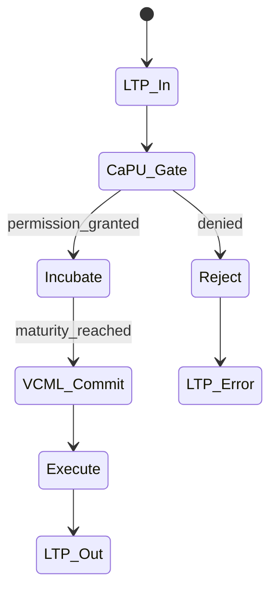
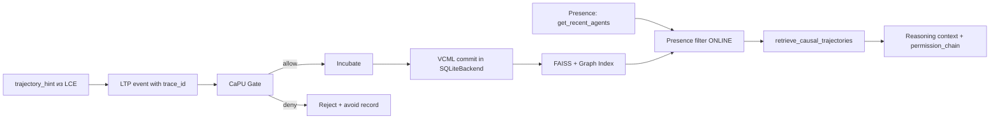
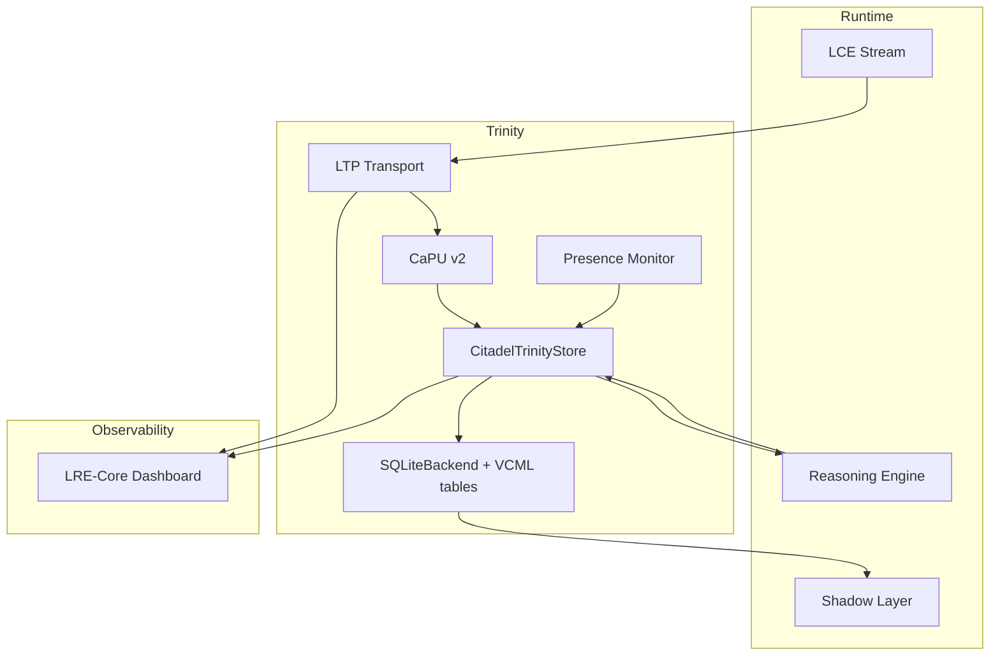

# ТЗ-2.4: Citadel Causal Memory Layer — Trinity Edition (LRE-Core + CaPU + VCML)

## Changelog
| Версия | Дата       | Изменения |
|--------|------------|-----------|
| 2.4    | 20.02.2026 | Полная Trinity-интеграция LRE-Core v1.0.0 (LTP + Persistence + Presence) + CaPU + VCML |
| 2.3    | 19.02.2026 | Финальная шлифовка Citadel 2.3 |
| 2.2    | 19.02.2026 | Добавлены CaPU + VCML |

## Метаданные
- **Проект:** Укрепление фундамента памяти Hexagon Core
- **Стадия:** ТЗ-2.3 → ТЗ-2.4 «Trinity Edition»
- **Версия:** 2.4
- **Дата:** 20 февраля 2026
- **Автор:** Главный Архитектор
- **Статус:** Ultimate production-ready к передаче в Codex Agent

## Glossary
- **Trinity** — синергия трёх слоёв: LRE-Core (transport + persistence), CaPU (permission engine), VCML (causal records)
- **LTP** — Liminal Transport Protocol (trace_id, event registry)
- **LRE-Core** — Liminal Runtime Environment Core v1.0.0 «Persistence & Presence»
- **CaPU** — Causal Processing Unit (permission-first lifecycle)
- **VCML** — Verifiable Causal Memory Layer

## Цель
Создать **Citadel Trinity** — единую долгосрочную causal trajectory memory уровня enterprise 2026:
- LRE-Core обеспечивает транспорт, атомарность и presence;
- CaPU — permission-first созревание и lifecycle;
- VCML — immutable accountability и explainability.

Ожидаемые эффекты:
- ускорение обучения ≥ 45 %;
- 100 % causal accountability;
- нулевое повторение ошибок с traceable root-cause;
- готовность к multi-agent coordination.

## Архитектурные принципы (Trinity Core)
1. **LRE-Core Foundation** — все записи идут через LTP с обязательным `trace_id`.
2. **CaPU Permission-first** — каждая trajectory проходит `Gate → Incubate → Commit`.
3. **VCML Immutable Records** — causal accountability как единственный источник правды.
4. **Presence-aware** — Temporal Index учитывает ONLINE/OFFLINE статус агентов.
5. **Hierarchical + Adaptive** — short-term (LRE in-memory) → long-term (VCML + SQLite).
6. **Zero-downtime + ACID + Thread-safety.**

## Исходные материалы
- <https://github.com/safal207/LRE-Core/releases/tag/v1.0.0> (LTP, SQLiteBackend, dashboard)
- <https://github.com/safal207/CaPU>
- <https://github.com/safal207/Causal-Memory-Layer/tree/main/vcml>
- `data/caPU_v2/`, `data/AdaptiveBrain/`
- `docs/LCE_IN_LS.md`, `docs/BOOTSTRAPPING_MECHANISM.md`, `docs/MERIT_LEDGER_CONSENSUS.md`

## Требования к реализации

### 1) Новый модуль Citadel Trinity Layer
Создать пакет: `python/modules/hexagon_core/citadel_trinity/`.
Ключевой класс: `CitadelTrinityStore` (обёртка над LRE-Core SQLiteBackend + CaPU engine + VCML serializer).

### 2) Транспорт и Persistence (LRE-Core)
- Все операции через LTP v1.0 (`trace_id` обязателен).
- Использовать `SQLiteBackend` из LRE-Core как базовое хранилище.
- Добавить таблицы VCML в существующую схему LRE-Core (`events` + `process_state`).
- Presence monitoring: `get_recent_agents()` интегрируется в Temporal Index.

### 3) Causal Trajectory Lifecycle (CaPU + LRE)
Каждая `trajectory_hint` проходит:
- `LTP → CauseIn → Gate (permission check) → Incubate → Commit (VCML record) → Execute`.
- `Reject → LTP error event + avoid record`.

### 4) Хранение в VCML + LRE формате
Расширенная структура (LTP message + VCML):
```json
{
  "trace_id": "550e8400-e29b-41d4-a716-446655440000",
  "type": "citadel_commit",
  "timestamp": "2026-02-20T12:41:00.000Z",
  "payload": {
    "vCML_id": "...",
    "cause": "...",
    "intent_vector": [...],
    "permission_chain": [...],
    "responsibility": "...",
    "success_score": 0.0,
    "lessons": [...],
    "causal_relevance": 0.82
  }
}
```

### 5) Adaptive Learning + Retrieval
- Обновление весов: `new_weight = old × 0.80 + success_delta × 0.20`.
- Retrieval: FAISS + graph similarity + presence filter из LRE-Core.
- Experience replay: `top-k=6` по relevance ≥ 0.78 с приоритетом ONLINE-агентов.

### 6) Интеграция с LCE и Temporal Index
- Новый LCE → LTP event → `CaPU.process` → VCML commit.
- Reasoning → `retrieve_causal_trajectories(..., include_presence=true)`.

## Non-functional требования
- Latency чтения < 25 мс (p95) при 20 000 записей.
- Запись < 8 мс (ACID через LRE-Core).
- Падение производительности Hexagon Core ≤ 4 %.
- Persistent: LRE-Core SQLite + опционально S3 backup.
- Полная thread-safety + T-Trace совместимость.

## Тестовое покрытие
- 22+ unit-тестов (LTP + CaPU transitions + VCML validation).
- 5 интеграционных сценариев (включая presence-aware retrieval и full Trinity lifecycle).
- Coverage ≥ 95 % для `citadel_trinity`.

## Acceptance Criteria
- [ ] Полный Trinity lifecycle (`LTP → CaPU → VCML`) для каждой trajectory.
- [ ] Causal relevance ≥ 0.78 на 3 реальных сценариях из docs/.
- [ ] Повторные causal-ошибки снижены ≥ 45 %.
- [ ] Shadow Layer использует VCML + LRE presence в 100 % рефлексий.
- [ ] Падение производительности ≤ 4 % (benchmark до/после).
- [ ] Dashboard LRE-Core показывает Citadel события в реальном времени.
- [ ] Все тесты зелёные + CI job `test_citadel_trinity`.

## Mermaid-диаграмма 1: Trinity Lifecycle


## Mermaid-диаграмма 2: VCML + Presence Retrieval Flow


## Mermaid-диаграмма 3: Trinity Integration + LRE Dashboard


## Риски и mitigation
- Latency от state machine → cache mature trajectories + Rust bindings.
- Миграция схемы LRE-Core → автоматический скрипт на старте.

## Оценка усилий
- 7–9 рабочих дней (Python 70 %, Rust 2 дня).
- Критичный путь: дни 1–4 (LRE-Core foundation + CaPU integration).

## Зависимости и следующий этап
- Зависимость: ТЗ-1 (LCE) — выполнено.
- После приёмки:
  1. код-ревью + merge;
  2. Trinity benchmark;
  3. **ТЗ-3** (Shadow Layer v2 + Merit Ledger + Trinity Synergy).
