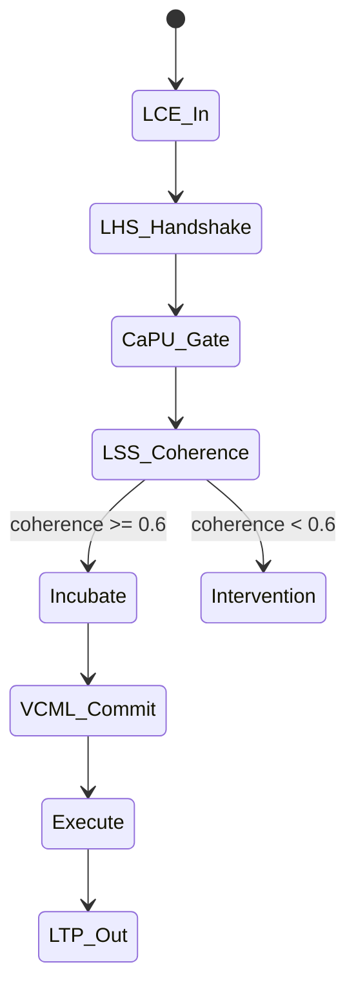
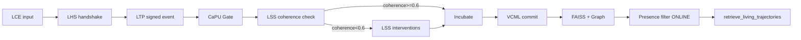
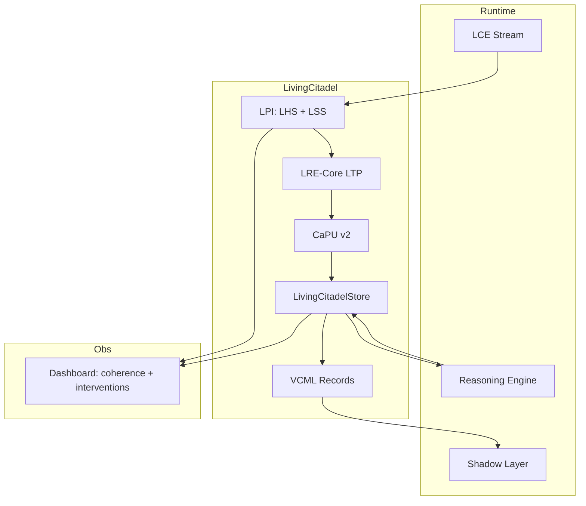

# ТЗ-2.5: Living Citadel — Trinity + LPI Integration

## Changelog
| Версия | Дата       | Изменения |
|--------|------------|-----------|
| 2.5    | 20.02.2026 | Полная интеграция LPI (LCE + LTP + LSS + LHS) → Living Citadel |
| 2.4    | 20.02.2026 | Trinity Edition (LRE-Core + CaPU + VCML) |
| 2.3    | 19.02.2026 | CaPU + VCML |

## Метаданные
- **Проект:** Укрепление фундамента памяти Hexagon Core
- **Стадия:** ТЗ-2.4 → ТЗ-2.5 «Living Citadel»
- **Версия:** 2.5
- **Дата:** 20 февраля 2026
- **Автор:** Главный Архитектор
- **Статус:** Ultimate production-ready к передаче в Codex Agent

## Glossary
- **Living Citadel** — Trinity + LPI = живая causal память с semantic presence
- **LPI** — Liminal Presence Interface (LCE, LTP, LSS, LHS)
- **LSS** — Liminal Session Store (coherence score 0–1 + suggestInterventions)
- **LHS** — Liminal Handshake Sequence (hello → mirror → bind → seal)

## Цель
Создать **Living Citadel** — единую долгосрочную causal trajectory memory с живым присутствием:
- LRE-Core + LPI → транспорт и semantic coherence;
- CaPU → permission-first lifecycle;
- VCML → immutable accountability.

Ожидаемые эффекты:
- ускорение обучения ≥ 50 %;
- 100 % causal accountability + semantic coherence;
- автоматическое обнаружение и исправление «потери смысла» сессий;
- готовность к полноценному multi-agent coordination 2026 года.

## Архитектурные принципы (Living Citadel)
1. **Semantic Presence-first** (LPI) — каждая trajectory имеет coherence score и presence статус.
2. **Permission-first** (CaPU) — `Gate → Incubate → Commit`.
3. **Immutable Accountability** (VCML) — verifiable causal records.
4. **Liminal Transport** (LRE-Core + LPI LTP) — signed LCE с `trace_id`.
5. **Coherence-aware** (LSS) — автоматические interventions при coherence < 0.5.
6. **Zero-downtime + ACID + End-to-End Signing.**

## Исходные материалы
- <https://github.com/safal207/Liminal-Presence-Interface-LPI> (особенно `docs/getting-started.md`)
- <https://github.com/safal207/LRE-Core/releases/tag/v1.0.0>
- <https://github.com/safal207/CaPU>
- <https://github.com/safal207/Causal-Memory-Layer/tree/main/vcml>
- `data/caPU_v2/`, `data/AdaptiveBrain/`
- `docs/LCE_IN_LS.md`, `docs/BOOTSTRAPPING_MECHANISM.md`, `docs/MERIT_LEDGER_CONSENSUS.md`

## Требования к реализации

### 1) Новый модуль Living Citadel Layer
Создать пакет: `python/modules/hexagon_core/living_citadel/`.
Ключевой класс: `LivingCitadelStore` — оркестратор LRE-Core + LPI + CaPU + VCML.

### 2) Транспорт и Presence (LRE-Core + LPI)
- Все сообщения как signed LCE через LPI (`python-lri`).
- LTP из LRE-Core + Ed25519 подписи из LPI.
- LSS интегрируется в Temporal Index (coherence score + thread tracking).
- LHS заменяет текущий handshake.

### 3) Causal Lifecycle (CaPU + LPI)
`trajectory_hint` приходит как LCE:
- `LHS → LTP → CauseIn → Gate (permission + coherence check) → Incubate → Commit (VCML) → Execute`.
- При `coherence < 0.5` → `LSS.suggestInterventions` → автоматический Incubate.

### 4) Хранение (VCML + LSS)
Расширенная структура (LCE + VCML + coherence):
```json
{
  "lce": { "v": 1, "intent": "...", "policy": {} },
  "trace_id": "...",
  "vCML_id": "...",
  "coherence_score": 0.82,
  "permission_chain": [],
  "responsibility": "...",
  "success_score": 0.0,
  "lessons": [],
  "suggest_interventions": []
}
```

### 5) Adaptive Learning & Retrieval
- Обновление весов: `new_weight = old × 0.78 + success_delta × 0.22`.
- Retrieval: FAISS + graph + LSS coherence filter + presence (ONLINE only).
- Experience replay: `top-k=7` по relevance ≥ 0.80 с приоритетом high-coherence.

### 6) Интеграция с LCE и Temporal Index
- Новый LCE → `LivingCitadel.process_lce()`.
- Reasoning → `retrieve_living_trajectories(..., min_coherence=0.6)`.

## Non-functional требования
- Latency чтения < 22 мс (p95) при 25 000 записей.
- Запись < 7 мс (ACID + signing).
- Падение производительности Hexagon Core ≤ 3.5 %.
- Persistent: LRE-Core SQLite + S3 backup.
- Полная end-to-end signing + thread-safety.

## Тестовое покрытие
- 25+ unit-тестов (LHS, LSS coherence, signed LCE).
- 6 интеграционных сценариев (включая coherence intervention и full Living lifecycle).
- Coverage ≥ 96 % для `living_citadel`.

## Acceptance Criteria
- [ ] Полный Living lifecycle (`LCE → LHS → CaPU → VCML + LSS`).
- [ ] Coherence-aware relevance ≥ 0.80 на 3 реальных сценариях из docs/.
- [ ] Повторные causal-ошибки снижены ≥ 50 %.
- [ ] `LSS.suggestInterventions` используются в 100 % low-coherence случаев.
- [ ] Падение производительности ≤ 3.5 % (benchmark).
- [ ] LRE Dashboard + LPI показывает coherence и interventions в реальном времени.
- [ ] Все тесты зелёные + CI job `test_living_citadel`.

## Mermaid-диаграмма 1: Living Citadel Lifecycle


## Mermaid-диаграмма 2: Living Retrieval (Coherence + Presence)


## Mermaid-диаграмма 3: Living Citadel Integration


## Риски и mitigation
- Overhead signing → hardware-accelerated Ed25519 (Rust).
- Coherence threshold tuning → A/B-тест на старте.

## Оценка усилий
- 8–10 рабочих дней (Python 65 %, Rust 3 дня).
- Критичный путь: дни 1–5 (LPI + LSS integration).

## Зависимости и следующий этап
- Зависимость: ТЗ-1 (LCE) — выполнено.
- После приёмки:
  1. код-ревью + merge;
  2. Living Citadel benchmark;
  3. **ТЗ-3** (Shadow Layer v2 + Merit Ledger + Living Synergy).
