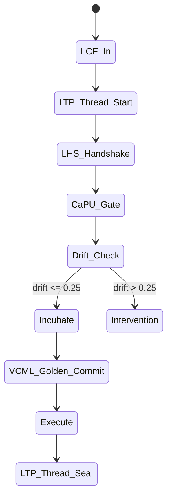
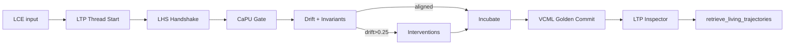
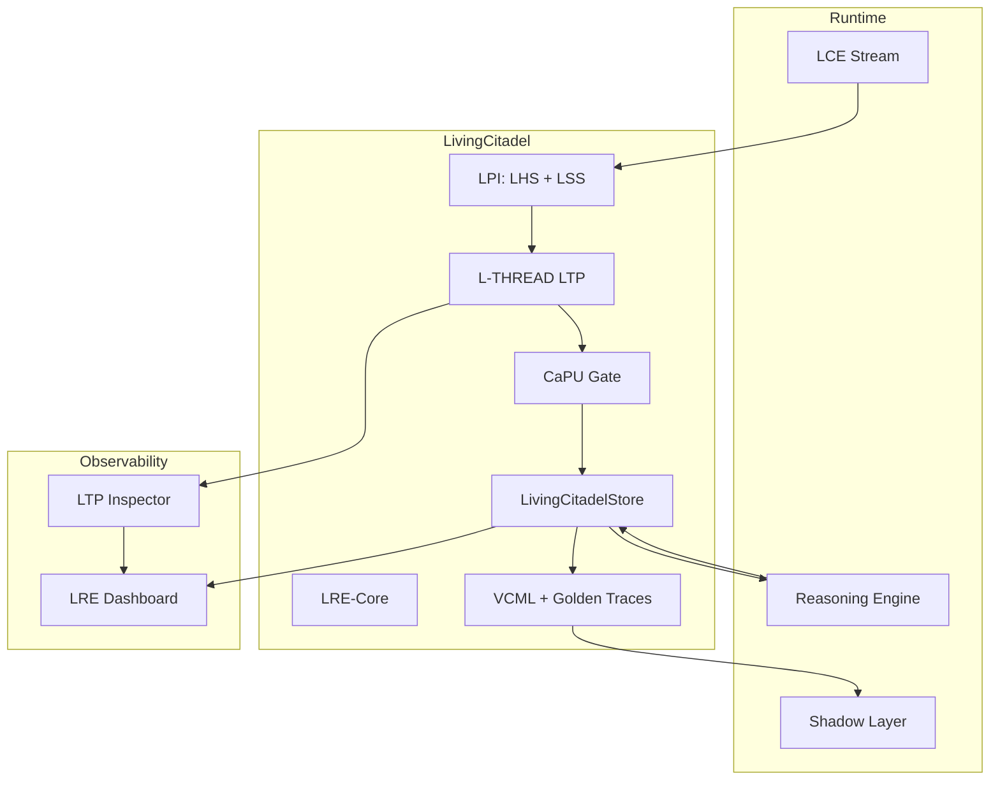

# ТЗ-2.6: Living Citadel + L-THREAD LTP (Liminal Thread Secure Protocol)

## Changelog
| Версия | Дата       | Изменения |
|--------|------------|-----------|
| 2.6    | 20.02.2026 | Полная интеграция L-THREAD LTP как контрольного слоя (orientation invariants, drift, deterministic replay, golden traces) |
| 2.5    | 20.02.2026 | Living Citadel + LPI (LCE + LSS + LHS) |
| 2.4    | 20.02.2026 | Trinity (LRE-Core + CaPU + VCML) |

## Метаданные
- **Проект:** Укрепление фундамента памяти Hexagon Core
- **Стадия:** ТЗ-2.5 → ТЗ-2.6 «Living Citadel + L-THREAD»
- **Версия:** 2.6
- **Дата:** 20 февраля 2026
- **Автор:** Главный Архитектор
- **Статус:** Ultimate production-ready к передаче в Codex Agent

## Glossary
- **L-THREAD / LTP** — Liminal Thread Secure Protocol (orientation invariants, drift measurement, admissible branching, deterministic replay)
- **Living Citadel** — полный стек: LRE-Core + LPI + L-THREAD LTP + CaPU + VCML
- **Golden Trace** — канонический, воспроизводимый `trace.jsonl` для регрессии и аудита
- **Drift Score** — накопленное отклонение от ориентации (`0.0 = идеально`)

## Цель
Создать **Living Citadel v2.6** — ориентированную causal trajectory memory с полным L-THREAD LTP:
- L-THREAD обеспечивает непрерывность нити, детерминированный replay и golden traces;
- LPI + LRE-Core → semantic presence и транспорт;
- CaPU → permission-first + orientation-first;
- VCML → immutable accountability.

Ожидаемые эффекты:
- ускорение обучения ≥ 55 %;
- 100 % deterministic replay + auditability;
- автоматическое предотвращение потери ориентации (`drift > 0.25`);
- готовность к enterprise multi-agent 2026 года.

## Архитектурные принципы (Living Citadel + LTP)
1. **Orientation-first** (L-THREAD) — каждая нить должна сохранять invariants.
2. **Permission + Orientation Gate** (CaPU + LTP).
3. **Immutable + Golden Traces** (VCML + LTP).
4. **Semantic Presence** (LPI LSS + LTP drift).
5. **Deterministic Replay** (LTP inspector + golden traces).
6. **Zero-downtime + ACID + End-to-End Signing + Thread Safety.**

## Исходные материалы
- <https://github.com/safal207/L-THREAD-Liminal-Thread-Secure-Protocol-LTP-> (Canon v1.0, `docs/`, `rfc/`, `specs/`, `ltp-rust-node`)
- <https://github.com/safal207/Liminal-Presence-Interface-LPI>
- <https://github.com/safal207/LRE-Core/releases/tag/v1.0.0>
- <https://github.com/safal207/CaPU>
- <https://github.com/safal207/Causal-Memory-Layer/tree/main/vcml>

## Требования к реализации

### 1) Новый модуль Living Citadel + LTP Layer
Создать пакет: `python/modules/hexagon_core/living_citadel/`.
Ключевой класс: `LivingCitadelStore` (LTP Thread Manager + LRE + LPI + CaPU + VCML).

### 2) L-THREAD LTP как контрольный слой
- Каждая `trajectory_hint` оборачивается в LTP Thread (`trace.jsonl`).
- Формат идентификатора: `thread_id = ltp-{uuid-v7}` (time-ordered).
- Проверка 5–7 Orientation Invariants на Gate.
- Drift measurement после каждого шага.
- Admissible Branching для experience replay.
- Golden Trace generation + CI validation через `ltp inspect`.

### 3) Полный Lifecycle (LTP + LPI + CaPU)
`LCE (LPI) → LTP Thread Start → LHS Handshake →`
`CaPU Gate (permission + orientation invariants + coherence) →`
`Incubate (maturation + drift control) →`
`VCML Commit (golden trace) →`
`Execute → LTP Thread Continue / Seal`

При `drift > 0.25` или `coherence < 0.5` → `LSS.suggestInterventions` + Incubate.

### 4) Хранение (VCML + LTP Golden Trace)
Структура (LCE + LTP + VCML):
```json
{
  "thread_id": "ltp-550e8400...",
  "trace_id": "...",
  "drift_score": 0.12,
  "orientation_status": "aligned",
  "lce": {},
  "vCML_id": "...",
  "permission_chain": [],
  "coherence_score": 0.85,
  "golden_trace_path": "traces/golden/20260220-..."
}
```

### 5) Adaptive Learning & Retrieval
- Обновление весов: `new_weight = old × 0.75 + success_delta × 0.25`.
- Retrieval: FAISS + graph + LTP drift filter + LSS coherence + presence.
- Experience replay: `top-k=8` по relevance ≥ 0.82 с приоритетом low-drift golden traces.

### 6) Интеграция с LCE / Temporal Index / Shadow Layer
- Новый LCE → `LivingCitadel.process_lce()` → LTP Thread.
- Reasoning → `retrieve_living_trajectories(..., max_drift=0.20, min_coherence=0.65)`.
- Shadow Layer получает drift + `suggestInterventions` + golden replay.

## Non-functional требования
- Latency чтения < 20 мс (p95) при 30 000 записей.
- Запись < 6 мс (ACID + signing + LTP).
- Падение производительности Hexagon Core ≤ 3 %.
- Persistent: LRE-Core SQLite + LTP golden traces + S3.
- Полная deterministic replay + `compliance_report.json` на каждый релиз.

## Тестовое покрытие
- 28+ unit-тестов (orientation invariants, drift calc, golden trace validation).
- 7 интеграционных сценариев (full LTP thread lifecycle, drift intervention, deterministic replay).
- Coverage ≥ 97 % для `living_citadel`.
- CI: `ltp inspect --golden` как обязательный шаг.

## Acceptance Criteria
- [ ] Полный LTP Thread lifecycle (`LCE → LTP → CaPU → VCML + golden trace`).
- [ ] Drift-aware relevance ≥ 0.82 на 3 реальных сценариях из docs/.
- [ ] Повторные causal-ошибки снижены ≥ 55 %.
- [ ] Orientation invariants и drift control работают в 100 % случаев.
- [ ] Deterministic replay идентичен оригиналу (byte-perfect).
- [ ] LRE Dashboard + LTP inspector показывает drift и golden traces в реальном времени.
- [ ] Все тесты зелёные + CI job `test_living_citadel_ltp`.

## Mermaid-диаграмма 1: Living Citadel + LTP Lifecycle


## Mermaid-диаграмма 2: LTP Inspector + Coherence Flow


## Mermaid-диаграмма 3: Living Citadel LTP Integration


## Риски и mitigation
- Overhead LTP invariants → Rust node (`ltp-rust-node`) как optional backend.
- Golden trace storage → автоматический cleanup старше 90 дней.

## Оценка усилий
- 9–11 рабочих дней (Python 60 %, Rust 4 дня для LTP bindings).
- Критичный путь: дни 1–6 (LTP Thread Manager + golden traces).

## Зависимости и следующий этап
- Зависимость: ТЗ-1 (LCE) — выполнено.
- После приёмки:
  1. код-ревью + merge;
  2. Living Citadel + LTP benchmark;
  3. **ТЗ-3** (Shadow Layer v2 + Merit Ledger + Full Living Synergy).
