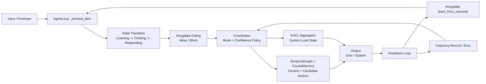

# GhostGPT (LS) — 1-Page Architecture Note

## 1) Overview

**GhostGPT (LS)** is a federated cognitive platform with hybrid memory, causal-temporal reasoning, and distributed orchestration.

It is designed to:
- keep short-term and long-term memory,
- model causal links across events,
- make adaptive decisions with emotional/safety gating,
- aggregate runtime and cognitive state into an operational system view.

---

## 2) Core Components & Responsibilities

| Component | Role | Key Notes |
|---|---|---|
| **AgentLoop** | Execution Loop | Main runtime loop: ingest input, transition states (`listening → thinking → responding`), run generation path, emit output and telemetry. |
| **Coordinator** | Mode & Confidence Policy | Selects processing mode (`A/B/both`), computes confidence shaping, fuses orientation/trajectory/field signals into decision payloads. |
| **Amygdala** | Safety & Adaptation Gate | Enforces gating and affective safety checks, updates adaptive bias and personality dynamics from outcomes. |
| **TemporalGraph / CausalMemory (Rust Core)** | Memory & Knowledge Aggregation | Maintains causal-temporal-resonance links, supports retrieval/context reconstruction, Rust-backed memory primitives for performance. |
| **KACL Aggregator** | System Resource Aggregation | Aggregates CPU/RAM/I/O/perf counters into operational state classes (e.g., `overload`, `stable`, `high_throughput`). |

---

## 3) Memory Architecture

### Hybrid Memory
- **STM (runtime / AgentLoop `self.memory`)**: active conversational and control context.
- **LTM (CausalMemory / RustCausalMemory)**: layered causal nodes and transitions.
- **Graph Layer (TemporalGraph + causal links)**: temporal, causal, and resonance edges for cross-event reasoning.
- **Auxiliary optimization**: Rust-side structures (including caches) for fast retrieval and low-latency operations.

### Why it matters
This layout separates fast operational context from persistent causal structure, enabling stable behavior and cross-session continuity.

---

## 4) Decision Flow

---

## 5) Adaptation & Feedback

- **Outcome evaluation**: outcome signals are recorded and used to adjust behavior over time.
- **Online policy shaping**: confidence dynamics and bias layers influence subsequent mode selection.
- **Cognitive consolidation**: reflections and historical traces feed future context quality and stability.

---

## 6) Aggregation Layer

- **Coordinator Snapshot**: cognitive state bundle (`orientation`, `confidence`, `trajectory`, `field_bias`) for decision transparency.
- **KACL Snapshot**: low-level system telemetry summarized into health/load states.
- **Observability/Event Streams**: event capture enables post-factum reconstruction and external monitoring integration.

---

## 7) Key Takeaways

1. **Federated cognitive control plane**: distributed control instead of a single monolithic “brain manager”.
2. **Rust acceleration where it matters**: memory graph operations, retrieval support, and performance-sensitive primitives.
3. **Multi-level adaptation**: emotional gating + confidence shaping + trajectory-based correction.
4. **Web4-ready posture**: modular enough for decentralized agent interoperability and knowledge-network evolution.
