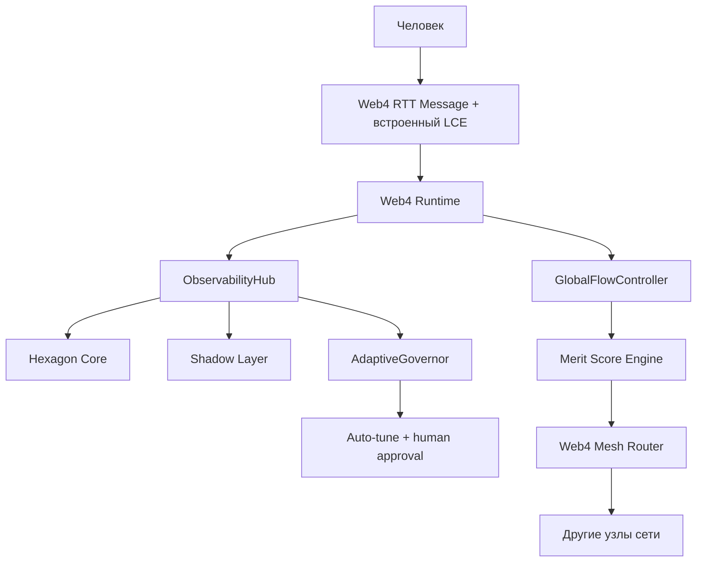

# LCE_IN_LS.md
**Версия:** 1.4 (лучшая финальная)  
**Дата:** 19 февраля 2026  
**Автор:** Главный архитектор LS

### 1. Назначение

Внедрить **LCE (Liminal Context Envelope)** как встроенный metadata-блок в структуру Web4 RTT Message.

LCE — это **Layer 8 протокол присутствия**: он передаёт не только текст, но и намерение, эмоциональное состояние, семантику, нить разговора, consent и coherence — всё в одном объекте, который летит с каждым сообщением.

### 2. Почему встроенный LCE — лучший вариант для LS

- Минимализм: один RTT-объект вместо payload + внешнего envelope.
- Нативная интеграция: все компоненты LS читают `message.lce` напрямую.
- Coherence-by-default: ObservabilityHub сразу считает drift.
- Synergy-ready: `merit_context` и `synergy_hint` доступны Mesh Router и Merit Engine без трансформаций.
- Governance-safe: human-in-the-loop и consent-first встроены на уровне протокола.

### 3. Архитектурное место LCE



### 4. LCE как Шесть Путей Современного Мудреца

Метафора «Шести Путей» фиксирует ключевой принцип LS:  
**сила системы не должна быть заперта в одном узле**. Она должна распределяться, передаваться и усиливаться через сеть.

Как Мудрец Шести Путей разделил свою силу, чтобы она жила дальше, так и мы делаем LCE носителем присутствия, которое течёт через всю систему.

| Путь                  | Поле LCE                     | Что передаёт дальше |
|-----------------------|------------------------------|---------------------|
| Путь Разума           | `intent` + `meaning`         | Цель и семантика |
| Путь Эмоций           | `affect`                     | Эмоциональное присутствие |
| Путь Памяти           | `thread_id` + `t`            | Нить непрерывности |
| Путь Согласия         | `policy.consent`             | Consent-first |
| Путь Качества         | `qos.coherence`              | Drift detection |
| Путь Синергии         | `merit_context` + `synergy_hint` + `trajectory_hint` | Меритократия и память путей |

### 5. Нормативная структура Web4 RTT Message (v1 + LCE)

```json
{
  "rtt_version": "1.0",
  "message_id": "msg_9f8a3b2e...",
  "trace_id": "trace_...",
  "payload": { ... },
  "lce": {
    "thread_id": "thread_550e8400...",
    "t": 1740003432,
    "intent": { "type": "ask", "goal": "..." },
    "affect": { "pad": [0.7, 0.4, 0.6], "tags": ["curious"] },
    "meaning": { "topic": "quantum", "ontology": "..." },
    "policy": { "consent": "full" },
    "qos": { "coherence": 0.92 },
    "ls_meta": {
      "merit_domain": "research",
      "synergy_hint": ["node_7a3f", "node_9c2d"],
      "trajectory_hint": {
        "past_successful": ["thread_abc123"],
        "avoid": ["thread_bad789"],
        "lessons": ["avoid overthinking when urgency high"]
      }
    }
  },
  "signature": "Ed25519..."
}
```

### 6. Ценные компоненты из репо для интеграции (топ-7)

В репозитории уже лежит много скрытого золота. Вот самые перспективные компоненты, которые можно вытащить и интегрировать в текущую архитектуру (LCE + Meritocracy Mesh + Observability closed-loop). Расположены по убыванию ценности и лёгкости интеграции:

| № | Компонент / Идея | Где лежит | Почему ценно для нас | Связь с LCE | Уровень усилий | Рекомендация |
|---|------------------|-----------|----------------------|--------------|----------------|--------------|
| 1 | **ncafuzzycore** (Rust fuzzy regulator) | `ncafuzzycore/` + Phase 14.3 | Адаптивное управление неопределённостью, smoothing coherence в LCE, мягкий тюнинг AdaptiveGovernor | `qos.coherence` smoothing + adaptive tuning | Низкий | **Приоритет №1** — интегрировать в Web4 Runtime |
| 2 | **CaPU v2 + AdaptiveBrain** | `data/` | Продвинутая память с experience replay и adaptive learning — идеально для trajectory_hint в LCE | `trajectory_hint` и долговременная память путей | Средний | Добавить в Hexagon Core как слой долгосрочной памяти |
| 3 | **WEB4_BIOFOUNDATIONS.md** | `docs/` | Био-инспирированные принципы (нейрон-подобные сети, самоорганизация) — отличная база для Mesh эволюции | Принципы для эволюции LCE-aware Mesh | Низкий (документ) | Использовать как вдохновение для Meritocracy + LCE |
| 4 | **PHASE145_GOVERNANCE.md** | `docs/` | Модель governance для децентрализованных систем — готовый блок для Meritocracy Mesh | `policy.consent` и human-in-the-loop governance | Средний | Интегрировать в MERIT_LEDGER_CONSENSUS.md |
| 5 | **META_LOGOS_PRINCIPLES + META_ONTOLOGICAL_MAPPING** | `docs/` | Мета-онтология и принципы смысла — усилит Beliefs Graph и meaning в LCE | Углубление `meaning`/semantics для LCE | Средний | Добавить в Hexagon Core как слой мета-уровня |
| 6 | **FIELD_AWARE_BIAS + FIELD_RESONANCE** | `docs/` (Phase 17–21) | Field-based cognitive architecture — динамическое взаимодействие агентов | Усиление affect/coherence динамики между узлами | Высокий | Рассмотреть для Phase 23+ (после Mesh) |
| 7 | **codex/** (advanced agent logic) | `codex/` | Экспериментальные алгоритмы планирования и self-improvement | Улучшение decision-loop вокруг LCE сигналов | Средний | Cherry-pick полезные части в AgentLoop |

### 7. План внедрения (Phase 15–16)

1. Добавить обязательное поле `lce` в RTT Message (Rust + Python).
2. Обновить сериализацию/подпись RTT.
3. Расширить ObservabilityHub до LSS.
4. Подключить чтение LCE в Shadow Layer и AdaptiveGovernor.
5. Включить `synergy_hint` и `trajectory_hint` в Mesh Router.
6. Начать интеграцию топ-3 компонентов из таблицы выше.
7. Создать placeholder `GOVERNANCE_KEYS.md` для закрытия forward reference по governance.

### 8. Definition of Done

- Все RTT-сообщения содержат валидный `lce` блок.
- Корреляция по `trace_id` и `thread_id` работает end-to-end.
- AdaptiveGovernor делает минимум один тюнинг через human approval.
- Зафиксировано measurable improvement по coherence/latency/error-rate.
- Trajectory memory используется как центр ориентации путей и снижает повтор ошибок.
