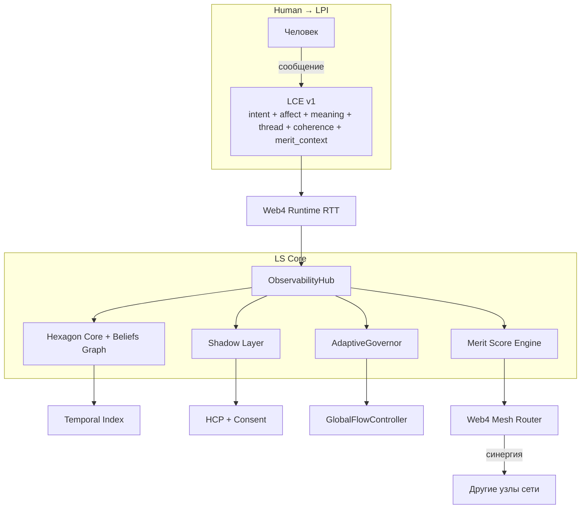

# LCE_IN_LS.md
**Версия:** 0.1 (draft, ready for review)
**Дата:** 19 февраля 2026
**Автор:** Архитектура LS

---

## 1. Назначение

Определить спецификацию **LCE (Liminal Context Envelope)** как Layer 8-протокол присутствия в LS:

- сохранение непрерывности намерения, смысла и тона между сессиями;
- безопасная передача контекстного снимка между компонентами LS и узлами Web4 Mesh;
- улучшение coherence, routing и мерит-синергии без нарушения consent-first принципа.

LCE не заменяет память/knowledge graph. LCE — это **моментальный envelope присутствия**, который связывает Human ↔ LPI ↔ Mesh.

---

## 2. Место в архитектуре LS



---

## 3. Поля LCE и интеграция

| Поле LCE | Компонент LS | Назначение |
|---|---|---|
| `intent` | Hexagon Core, AgentLoop | Цель и ожидаемый outcome текущего шага |
| `affect` | Shadow Layer | Аффективная калибровка тона/ответа |
| `meaning` | Beliefs Graph + Ontology | Семантическая непрерывность и disambiguation |
| `memory.thread`, `memory.t` | Temporal Index | Связность long-gap диалогов |
| `policy.consent` | HCP | Consent-first enforcement |
| `qos.coherence` | ObservabilityHub, AdaptiveGovernor | Drift detection и стабилизация качества |
| `merit_context` | Merit Score Engine | Контекст для синергии и NetworkEffectBonus |
| `synergy_hint` | Web4 Mesh Router | Интеллектуальный выбор соседей/маршрута |

---

## 4. LCE v1 JSON shape (normative)

```json
{
  "lce_version": "1.0",
  "trace_id": "01HR...",
  "session_id": "sess_...",
  "node_id": "ls-node-...",
  "intent": {
    "goal": "string",
    "priority": "low|normal|high|critical",
    "horizon": "single_turn|multi_turn|long_horizon"
  },
  "affect": {
    "tone": "neutral|warm|supportive|strict",
    "urgency": 0.0,
    "sensitivity": "low|medium|high"
  },
  "meaning": {
    "topic_tags": ["string"],
    "entities": ["string"],
    "constraints": ["string"],
    "confidence": 0.0
  },
  "memory": {
    "thread": "thread_...",
    "t": "2026-02-19T12:00:00Z",
    "continuity_anchor": "hash_or_pointer"
  },
  "policy": {
    "consent": "required|granted|revoked",
    "retention": "ephemeral|short|standard|extended",
    "redaction": ["pii", "secrets"]
  },
  "qos": {
    "coherence": 0.0,
    "drift_risk": 0.0,
    "latency_budget_ms": 1200
  },
  "merit_context": {
    "task_type": "reasoning|routing|adapter_eval|synthesis",
    "synergy_weight": 0.0,
    "expected_validation_peers": 3
  },
  "synergy_hint": {
    "preferred_peers": ["node_a", "node_b"],
    "region_bias": "eu-west",
    "capabilities": ["lora-eval", "belief-sync"]
  },
  "signature": "ed25519:..."
}
```

### 4.1 Validation constraints (v1)

- `lce_version` MUST be `1.0`.
- `trace_id`, `session_id`, `node_id` MUST be present.
- `policy.consent` MUST gate downstream actions requiring memory persistence or cross-node sharing.
- `qos.coherence` and `qos.drift_risk` MUST be within `[0.0, 1.0]`.
- Envelope MUST be signed (`signature`) before cross-node propagation.

---

## 5. Transport integration (Web4 Runtime)

LCE передаётся в RTT как отдельный заголовок/метаполе:

- Header name: `x-ls-lce` (base64url(JSON)) для lightweight path;
- или `lce_ref` (pointer) при крупном envelope и вынесенном storage.

### 5.1 TTL и размер

- Max inline size: 8 KB.
- Recommended TTL: 15 минут для realtime-контуров.
- При истечении TTL узел MUST rehydrate envelope через `continuity_anchor`.

---

## 6. Observability integration

ObservabilityHub должен фиксировать LCE-события:

- `lce_ingested`
- `lce_drift_detected`
- `lce_consent_blocked`
- `lce_routing_applied`
- `lce_coherence_improved`

Минимальные индексы:

- `trace_id`
- `session_id`
- `memory.thread`
- `node_id`
- `policy.consent`

---

## 7. Governance & safety

1. **Human-in-the-loop**: действия типа auto-tune/route override, влияющие на пользовательскую траекторию, требуют approval при `sensitivity=high`.
2. **Consent-first**: `policy.consent != granted` блокирует кросс-узловую репликацию LCE.
3. **Redaction-first**: перед экспортом в mesh MUST применяться `policy.redaction`.
4. **Replay protection**: использовать `(trace_id, t, signature)` + окно допустимого skew.

---

## 8. Merit & synergy semantics

- `merit_context.synergy_weight` влияет на приоритет задач синергии в пределах допустимых bootstrap/consensus правил.
- `synergy_hint` используется как soft-signal для роутера; не может обходить safety/consent/policy ограничения.
- Любое merit-влияние LCE должно быть аудируемо через trace linkage в Merkle-учётных событиях.

---

## 9. Минимальный rollout план (Phase 15–16)

1. **Spec lock**: утвердить LCE v1 поля и валидации.
2. **Runtime**: добавить `x-ls-lce` / `lce_ref` поддержку в Web4 RTT.
3. **Hub**: добавить ingest + индексацию + drift events в ObservabilityHub.
4. **Governor**: подключить `qos.coherence/drift_risk` как входы тюнинга.
5. **Mesh**: включить `synergy_hint` как soft routing signal.
6. **Audit**: добавить журнал consent/redaction/replay-check решений.

---

## 10. Open questions

- Нужен ли бинарный формат (CBOR/MessagePack) для hot path вместо JSON?
- Где хранить `continuity_anchor` (локально vs distributed KV)?
- Как нормализовать `affect.tone` между языками/культурами?
- Нужен ли отдельный LCE schema registry с version negotiation?

