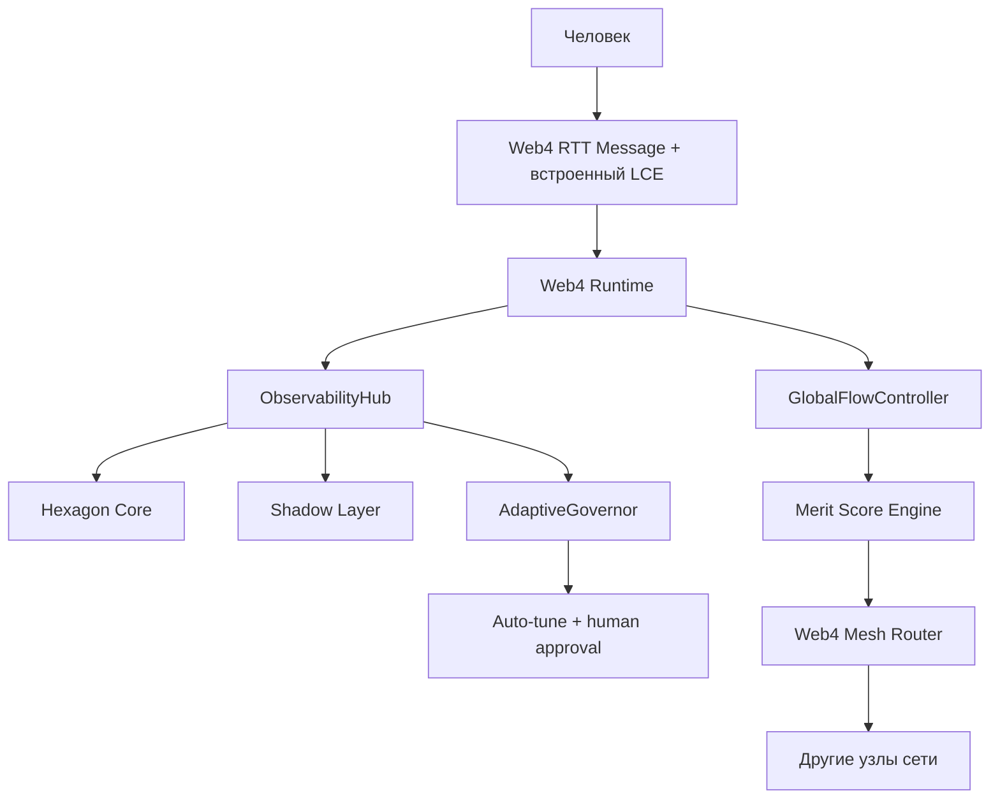

# LCE_IN_LS.md
**Версия:** 1.1 (с разделом про Мудреца Шести Путей)  
**Дата:** 19 февраля 2026  
**Автор:** Главный архитектор LS

### 1. Назначение

Внедрить **LCE (Liminal Context Envelope)** как встроенный metadata-блок в структуру Web4 RTT Message.

LCE — это **Layer 8 протокол присутствия**: он передаёт не только текст, но и намерение, эмоциональное состояние, семантику, нить разговора, consent и coherence — всё в одном объекте, который летит с каждым сообщением.

### 2. Почему встроенный LCE — лучший вариант для LS

- Минимализм: один RTT-объект вместо payload + внешнего envelope.
- Нативная интеграция: все компоненты LS читают `message.lce` напрямую.
- Coherence-by-default: ObservabilityHub сразу считает drift.
- Synergy-ready: `merit_context` и `synergy_hint` доступны Mesh Router и Merit Engine без трансформаций.
- Governance-safe: human-in-the-loop и consent-first встроены на уровне протокола.

### 3. Архитектурное место LCE



### 4. LCE как Шесть Путей Современного Мудреца

Ты вспомнил **Мудреца Шести Путей** (Хагоромо Ооцуцуки) — того, кто разделил свою силу на шесть путей, чтобы она не умерла вместе с ним, а продолжала жить в мире через разных людей.

Это идеальная метафора для того, что мы делаем.

**Один человек (или одна большая модель) не может нести всю силу вечно.**  
Нужно разделить силу на пути, создать систему передачи, чтобы каждый достойный мог получить свою часть и продолжить путь дальше.

LCE — это и есть наш **«Чакра Шести Путей»**:

| Путь                  | Поле LCE                     | Что передаёт дальше |
|-----------------------|------------------------------|---------------------|
| Путь Разума           | `intent` + `meaning`         | Цель и семантика    |
| Путь Эмоций           | `affect`                     | Эмоциональное присутствие |
| Путь Памяти           | `thread_id` + `t`            | Нить непрерывности  |
| Путь Согласия         | `policy.consent`             | Consent-first       |
| Путь Качества         | `qos.coherence`              | Drift detection     |
| Путь Синергии         | `ls_meta.merit_domain` + `synergy_hint` | Меритократия и обмен силой |

Мы не пытаемся сделать одного сверхмощного «Наруто-агента».  
Мы создаём **систему**, где сила (присутствие, опыт, обучение) может течь через множество узлов, усиливаться через синергию и жить дальше, даже если один узел «уйдёт».

LCE — это тот самый механизм, который позволяет **разделить силу Мудреца** и передать её дальше.

### 5. Нормативная структура Web4 RTT Message (v1 + LCE)

```json
{
  "rtt_version": "1.0",
  "message_id": "msg_9f8a3b2e...",
  "trace_id": "trace_...",
  "payload": { ... },
  "lce": {
    "thread_id": "thread_550e8400...",
    "t": 1740003432,
    "intent": { "type": "ask", "goal": "..." },
    "affect": { "pad": [0.7, 0.4, 0.6], "tags": ["curious"] },
    "meaning": { "topic": "quantum", "ontology": "..." },
    "policy": { "consent": "full" },
    "qos": { "coherence": 0.92 },
    "ls_meta": {
      "merit_domain": "research",
      "synergy_hint": ["node_7a3f", "node_9c2d"]
    }
  },
  "signature": "Ed25519..."
}
```

### 6. План внедрения (Phase 15–16)

1. Добавить обязательное поле `lce` в RTT Message (Rust + Python).
2. Обновить сериализацию/подпись RTT.
3. Расширить ObservabilityHub до LSS.
4. Подключить чтение LCE в Shadow Layer и AdaptiveGovernor.
5. Включить `synergy_hint` в Mesh Router.

### 7. Definition of Done

- Все RTT-сообщения содержат валидный `lce` блок.
- Корреляция по `trace_id` и `thread_id` работает end-to-end.
- AdaptiveGovernor делает минимум один тюнинг через human approval.
- Зафиксировано measurable improvement по coherence/latency/error-rate.
