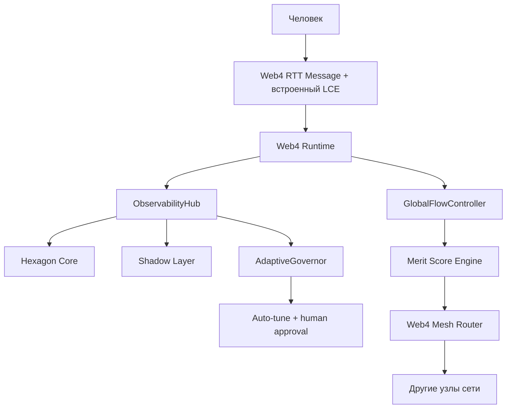

# LCE_IN_LS.md
**Версия:** 0.2 (готов к коммиту)
**Дата:** 19 февраля 2026
**Автор:** Архитектура LS

---

## 1. Назначение

Определить интеграцию **LCE (Liminal Context Envelope)** как **встроенный metadata layer** внутри `Web4 RTT Message`.

Ключевой принцип v0.2:
- LCE не передаётся «рядом» (не отдельный envelope/header-only путь),
- LCE является обязательным блоком `message.lce` в структуре RTT-сообщения.

Это даёт единый источник правды для presence/coherence/synergy в LS.

---

## 2. Архитектурный подход



---

## 3. Почему встроенный LCE лучше для LS

1. **Минимализм:** один RTT-объект вместо payload + внешнего envelope.
2. **Нативная интеграция:** все компоненты LS читают `message.lce` напрямую без дополнительного протокола заголовков.
3. **Coherence-by-default:** ObservabilityHub может считать coherence и drift по каждому сообщению в едином формате.
4. **Synergy-ready:** `lce.ls_meta.synergy_hint` и `lce.ls_meta.merit_domain` доступны роутеру и merit-контуру без трансформаций.
5. **Governance-safe:** human-in-the-loop для тюнинга и изменения траектории поведения.

---

## 4. Нормативная структура Web4 RTT Message (v1 + LCE)

```json
{
  "rtt_version": "1.0",
  "message_id": "msg_9f8a3b2e...",
  "trace_id": "trace_...",
  "payload": {},
  "lce": {
    "thread_id": "thread_550e8400...",
    "t": 1740003432,
    "intent": { "type": "ask", "goal": "..." },
    "affect": { "pad": [0.7, 0.4, 0.6], "tags": ["curious"] },
    "meaning": { "topic": "quantum", "ontology": "..." },
    "policy": { "consent": "full" },
    "qos": { "coherence": 0.92 },
    "ls_meta": {
      "merit_domain": "research",
      "synergy_hint": ["node_7a3f", "node_9c2d"]
    }
  },
  "signature": "Ed25519..."
}
```

### 4.1 Обязательные требования

- `message.lce` MUST присутствовать во всех RTT-сообщениях уровня task/reasoning/synergy.
- `message.trace_id` MUST совпадать с trace-контекстом observability pipeline.
- `lce.thread_id` MUST быть стабилен в пределах одной нити диалога.
- `lce.policy.consent` MUST проверяться перед cross-node репликацией и persistence.
- `lce.qos.coherence` MUST быть в диапазоне `[0.0, 1.0]`.
- RTT `signature` MUST покрывать и `payload`, и `lce`.

---

## 5. Поля LCE и маршрутизация по LS-компонентам

| Поле LCE | Компоненты-потребители | Эффект |
|---|---|---|
| `intent` | Hexagon Core, AgentLoop | Точная целевая интерпретация шага |
| `affect` | Shadow Layer | Эмоционально корректная генерация ответа |
| `meaning` | Beliefs Graph, Ontology | Семантическая непрерывность |
| `thread_id`, `t` | Temporal Index, ObservabilityHub | Непрерывность между сессиями |
| `policy.consent` | HCP, Hub, Mesh | Consent-first enforcement |
| `qos.coherence` | ObservabilityHub, AdaptiveGovernor | Drift detection и адаптивный тюнинг |
| `ls_meta.merit_domain` | Merit Score Engine | Контекстная оценка вклада |
| `ls_meta.synergy_hint` | Web4 Mesh Router | Soft-priority при выборе узлов |

---

## 6. Observability и LSS (Liminal Session Store)

ObservabilityHub расширяется до **LSS**:

- хранение агрегатов coherence по `thread_id`;
- корреляция `trace_id` → RTT → reasoning → routing outcome;
- события:
  - `lce_ingested`,
  - `lce_coherence_drift`,
  - `lce_consent_blocked`,
  - `lce_synergy_route_applied`.

Минимальные ключи индексации: `trace_id`, `message_id`, `thread_id`, `node_id`, `policy.consent`.

---

## 7. Safety, governance и human approval

1. **Human-in-the-loop mandatory:** AdaptiveGovernor не применяет high-impact изменения без human approval.
2. **Canary + rollback gates:** любое изменение, инициированное на основе LCE-drift, идёт через canary и rollback-порог.
3. **Consent-first:** при `policy.consent != full` cross-node sharing ограничивается политикой.
4. **Replay protection:** `(message_id, thread_id, t, signature)` + окно допустимого времени.

---

## 8. Влияние на Merit и Synergy

- `ls_meta.merit_domain` используется как контекст при подсчёте сигналов качества задачи.
- `ls_meta.synergy_hint` — soft-signal для роутера, не обходящий safety/policy ограничения.
- Любое влияние LCE на merit-решения должно быть трассируемо через `trace_id` и журнал решений.

---

## 9. План внедрения (Phase 15–16)

1. Добавить обязательное поле `lce` в структуры RTT (Rust + Python bindings).
2. Обновить сериализацию/подпись RTT для покрытия `payload+lce`.
3. Расширить ObservabilityHub до LSS и добавить coherence drift events.
4. Подключить чтение LCE в Shadow Layer и AdaptiveGovernor.
5. Включить `synergy_hint` в Web4 Mesh Router как soft-priority сигнал.

---

## 10. Definition of Done

- Все RTT-сообщения содержат валидный `lce` блок.
- Корреляция по `trace_id` и `thread_id` работает end-to-end.
- AdaptiveGovernor делает минимум один успешный тюнинг через human approval.
- Зафиксировано measurable improvement по coherence/latency/error-rate на workload re-run.

