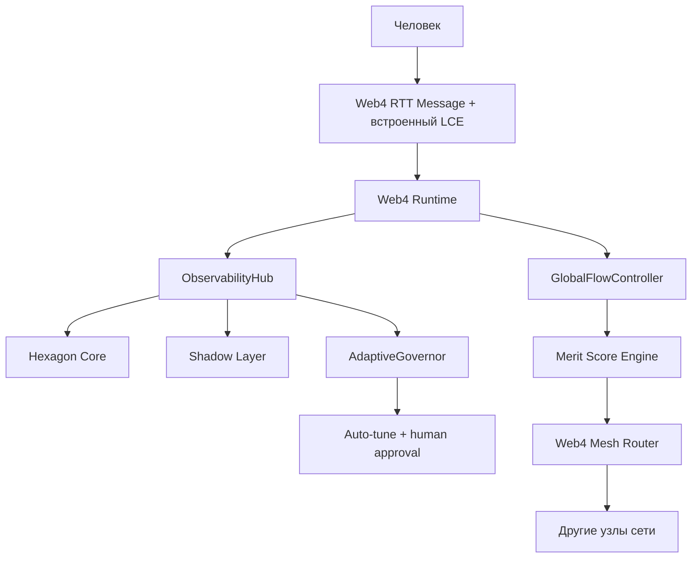

# LCE_IN_LS.md
**Версия:** 1.5 (normative refresh)
**Дата:** 19 февраля 2026
**Автор:** Главный архитектор LS

### 1. Назначение

Внедрить **LCE (Liminal Context Envelope)** как встроенный metadata-блок в структуру Web4 RTT Message.

LCE — это **Layer 8 протокол присутствия**: он передаёт не только текст, но и намерение, эмоциональное состояние, семантику, нить разговора, consent и coherence — всё в одном объекте, который летит с каждым сообщением.

### 2. Архитектурное место LCE



### 3. Нормативные требования протокола (MUST)

Следующие правила обязательны для Rust/Python имплементаций и для валидации межузловой совместимости.

1. `lce.policy.consent` **MUST** проверяться до любой cross-node репликации/ретрансляции.
2. RTT `signature` **MUST** покрывать и `payload`, и `lce` (единый подписываемый канонический объект).
3. `lce.qos.coherence` **MUST** быть в диапазоне `[0.0, 1.0]`.
4. `lce.thread_id` **MUST** быть стабилен в рамках одной нити диалога.
5. `message_id` **MUST** быть уникален в пределах retention window узла.
6. `lce.t` **MUST** быть монотонным в рамках `thread_id` (допустимы одинаковые значения только при явной политике tie-break).

### 4. Нормативная структура Web4 RTT Message (v1 + LCE)

```json
{
  "rtt_version": "1.0",
  "message_id": "msg_9f8a3b2e...",
  "trace_id": "trace_...",
  "payload": { ... },
  "lce": {
    "thread_id": "thread_550e8400...",
    "t": 1740003432,
    "intent": { "type": "ask", "goal": "..." },
    "affect": { "pad": [0.7, 0.4, 0.6], "tags": ["curious"] },
    "meaning": { "topic": "quantum", "ontology": "..." },
    "policy": { "consent": "full" },
    "qos": { "coherence": 0.92 },
    "ls_meta": {
      "merit_domain": "research",
      "synergy_hint": ["node_7a3f", "node_9c2d"],
      "trajectory_hint": {
        "past_successful": ["thread_abc123"],
        "avoid": ["thread_bad789"],
        "lessons": ["avoid_overthinking_when_urgency_high"]
      }
    }
  },
  "signature": "Ed25519..."
}
```

#### 4.1 Примечание по `trajectory_hint.lessons`

- Для межузлового машинного использования `lessons` **SHOULD** быть нормализованными токенами/кодами (например snake_case).
- Свободный human-readable текст **MAY** передаваться отдельно (например `lessons_human`) и не должен быть критичным для протокольной логики маршрутизации/консенсуса.

### 5. Safety и Governance (обязательно для production)

1. Human-in-the-loop для критичных auto-tune изменений **MUST** быть включён (approval gate).
2. Canary + rollback gates **MUST** применяться перед глобальным rollout регуляторов.
3. Replay protection **MUST** использовать минимум кортеж:
   - `(message_id, thread_id, t, signature)`.
4. При нарушении consent-политики сообщение **MUST** блокироваться до репликации.
5. Аудит-лог изменения лимитов и coherence-параметров **SHOULD** сохраняться для пост-мортем анализа.

### 6. План внедрения (Phase 15–16)

1. Добавить обязательное поле `lce` в RTT Message (Rust + Python).
2. Обновить сериализацию/подпись RTT.
3. Расширить ObservabilityHub до LSS.
4. Подключить чтение LCE в Shadow Layer и AdaptiveGovernor.
5. Включить `synergy_hint` и `trajectory_hint` в Mesh Router.
6. Начать интеграцию топ-3 компонентов из таблицы ниже.
7. Создать placeholder `GOVERNANCE_KEYS.md` для закрытия forward reference по governance.

### 7. Ценные компоненты из репо для интеграции (топ-7)

| № | Компонент / Идея | Где лежит | Почему ценно для нас | Связь с LCE | Уровень усилий | Рекомендация |
|---|------------------|-----------|----------------------|-------------|----------------|--------------|
| 1 | **ncafuzzycore** (Rust fuzzy regulator) | `ncafuzzycore/` + Phase 14.3 | Адаптивное управление неопределённостью, smoothing coherence в LCE, мягкий тюнинг AdaptiveGovernor | `qos.coherence` smoothing + adaptive tuning | Низкий | **Приоритет №1** — интегрировать в Web4 Runtime |
| 2 | **CaPU v2 + AdaptiveBrain** | `data/` | Продвинутая память с experience replay и adaptive learning | `trajectory_hint` и долговременная память путей | Средний | Добавить в Hexagon Core как слой долгосрочной памяти |
| 3 | **WEB4_BIOFOUNDATIONS.md** | `docs/` | Био-инспирированные принципы для Mesh эволюции | Принципы для эволюции LCE-aware Mesh | Низкий | Использовать как архитектурный reference |
| 4 | **PHASE145_GOVERNANCE.md** | `docs/` | Готовая governance-модель | `policy.consent` + HITL | Средний | Интегрировать в MERIT_LEDGER_CONSENSUS.md |
| 5 | **META_LOGOS_PRINCIPLES + META_ONTOLOGICAL_MAPPING** | `docs/` | Усиление смыслового слоя | Углубление `meaning` | Средний | Добавить в Hexagon Core как meta-layer |
| 6 | **FIELD_AWARE_BIAS + FIELD_RESONANCE** | `docs/` (Phase 17–21) | Динамическое взаимодействие агентов | Усиление affect/coherence между узлами | Высокий | Рассмотреть для Phase 23+ |
| 7 | **codex/** (advanced agent logic) | `codex/` | Экспериментальные алгоритмы планирования | Улучшение decision-loop | Средний | Cherry-pick полезные части в AgentLoop |

### 8. Definition of Done

- Все RTT-сообщения содержат валидный `lce` блок.
- Корреляция по `trace_id` и `thread_id` работает end-to-end.
- AdaptiveGovernor делает минимум один тюнинг через human approval.
- Зафиксировано measurable improvement по coherence/latency/error-rate.
- В Web4 Runtime включён fuzzy smoothing (`smooth_coherence` / `update_lce_coherence`) для стабилизации `qos.coherence` в шумных условиях.
- GlobalFlowController поддерживает adaptive режим `strategy="fuzzy"` для мягкого backpressure-тюнинга без жёстких порогов.
- Trajectory memory используется как центр ориентации путей и снижает повтор ошибок.

### Appendix A (non-normative): философская метафора

Метафора «Шести Путей Современного Мудреца» остаётся только как контекст и объяснение архитектурной идеи распределённого присутствия.
Она **не является** нормативной частью протокола и не должна использоваться как источник требований для валидации реализации.
