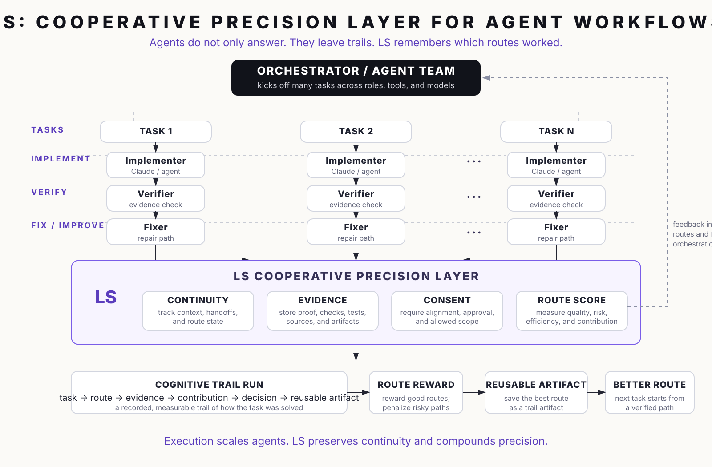

# LS Cooperative Precision Layer

Multi-agent systems should not start from zero every time.

LS turns agent work into cognitive trails:

```text
task
-> route
-> evidence
-> contribution
-> decision
-> reusable artifact
```

Agents do not only answer.
They leave trails.
LS remembers which routes worked.



## Why this layer exists

Multi-agent orchestration can scale execution quickly, but orchestration alone does not preserve the evidence needed for repeated, safe cooperation.

LS adds a cooperative precision layer around agent work:

```text
continuity before continuation
evidence before action
consent before memory
contribution before reputation
precision before scale
```

The goal is not to make models magically smarter.
The goal is to make repeated cooperation more precise by preserving the route, evidence, contribution, decision, and reusable artifact that came out of a work session.

## What LS tracks

| Signal | Question |
| --- | --- |
| Continuity | Did the workflow preserve context, handoffs, and route state? |
| Evidence | What proof, tests, sources, or artifacts support the result? |
| Consent | Is the proposed memory, action, or continuation allowed by the operator boundary? |
| Contribution | Which role or actor created verified value? |
| Route score | Should this route be reused, repaired, penalized, or held for review? |

## Cognitive trail run

The smallest durable artifact is a cognitive trail run:

```text
Cognitive Trail Run = one recorded measurable cooperation route
```

A trail run records:

- what task was attempted;
- which route of roles and actors participated;
- what evidence was produced;
- which role or actor contributed value;
- what decision was made;
- whether the route should be reused for the next similar task.

## Short positioning

```text
Agents answer.
LS remembers the trail.
```

```text
Models do not become magically smarter.
The cooperative network becomes more precise.
```

```text
Execution scales agents.
LS preserves continuity and compounds precision.
```

## First product wedge

The first narrow use case is:

```text
AI Code Review / PR Review Trail Network
```

A real git diff can move through a cooperative route:

```text
PR diff
-> draft reviewer
-> risk critic
-> evidence verifier
-> final review
-> route reward
-> reusable trail artifact
```

The next similar review should start from the best known verified route, not from zero.

## Boundary

This is not a claim that LS solves AI safety or makes a model generally intelligent.

This is a narrower engineering claim:

```text
verified cooperative route memory before continuation, action, memory, or reputation
```
