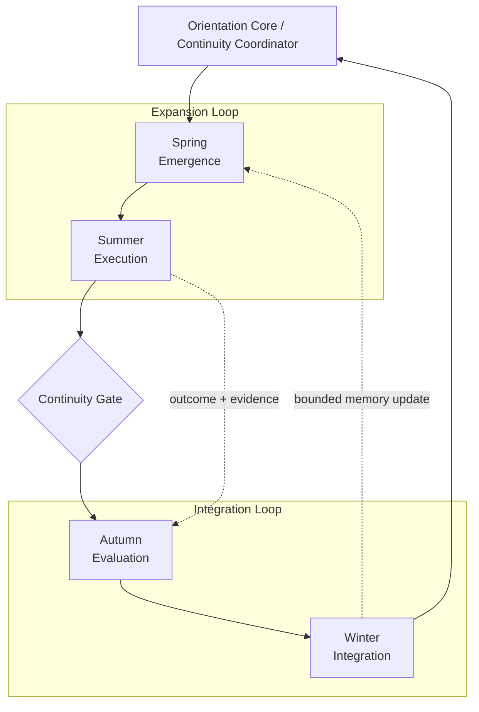

# LS Seasonal Infinity Model

> A conceptual architecture for rhythmic continuity across emergence, execution,
> evaluation, and integration.

## Status

This document describes a **design model and vocabulary** for LS. It is not a
claim that every transition or runtime contract described below is already
implemented.

The model is intended to help connect LS continuity, evidence, memory,
orientation, and identity-safety work through one inspectable cycle.

---

## 1. Core idea

Many agent systems are described as linear pipelines:

```text
prompt -> action -> output
```

LS needs a longer-lived model:

```text
emergence -> execution -> evaluation -> integration -> renewed emergence
```

The system should not merely complete tasks. It should preserve continuity
between tasks, verify experience before reuse, and allow learning without
letting one noisy episode rewrite durable memory or operator identity.

The Seasonal Infinity Model represents this as two connected loops coordinated
by one orientation center:

- **Expansion Loop** — Spring + Summer
- **Integration Loop** — Autumn + Winter
- **Orientation Core** — keeps the current cycle aligned with evidence,
  consent, trajectory, and allowed scope
- **Continuity Gate** — controls the conversion of an event into durable memory
  or an identity-relevant update

---

## 2. Conceptual diagram



The diagram is intentionally cyclical rather than linear. Each completed cycle
should leave behind a reviewable artifact and a bounded reason for what may
continue into the next cycle.

---

## 3. The four phases

### Spring — Emergence

**Purpose:** generate and frame what may become worth doing.

Typical activities:

- receive a new signal;
- formulate an intent;
- create a bounded hypothesis;
- identify missing context;
- propose candidate routes;
- define the expected evidence.

Primary question:

> What is genuinely emerging here, and what is only noise?

Main failure modes:

- uncontrolled branching;
- novelty without relevance;
- unclear ownership;
- no success criterion;
- memory recall treated as current truth.

Expected exit artifact:

```text
intent + scope + candidate route + evidence requirement
```

---

### Summer — Execution

**Purpose:** act on the bounded hypothesis and observe the result.

Typical activities:

- select a route;
- execute an allowed action;
- collect outcome data;
- record actor and tool participation;
- preserve traceability;
- stop or escalate when evidence is insufficient.

Primary question:

> Are we amplifying value, or merely amplifying momentum?

Main failure modes:

- execution without approval;
- scaling an unverified hypothesis;
- route drift;
- missing provenance;
- treating fluent output as successful action.

Expected exit artifact:

```text
executed route + observed outcome + evidence references + trace
```

---

### Autumn — Evaluation

**Purpose:** determine what was actually demonstrated.

Typical activities:

- compare intent with observed outcome;
- verify evidence independently where possible;
- distinguish correlation from supported causality;
- score route and contributor usefulness;
- identify contradictions and unresolved uncertainty;
- produce a verified or rejected episode.

Primary question:

> What is supported strongly enough to preserve?

Main failure modes:

- analysis without a decision;
- confirmation bias;
- consensus confused with repeated wording;
- unsupported identity conclusions;
- retrospective rewriting of the original intent.

Expected exit artifact:

```text
verified episode | rejected episode | unresolved episode
```

---

### Winter — Integration

**Purpose:** compress, stabilize, retain, or discard the evaluated experience.

Typical activities:

- write bounded memory;
- archive evidence and trace references;
- update route weights;
- apply retention and decay rules;
- preserve non-claims and uncertainty;
- prepare the next cycle without forcing one.

Primary question:

> What should remain, what should decay, and what must not become identity?

Main failure modes:

- permanent storage of weak evidence;
- identity mutation from one episode;
- indefinite freezing;
- retaining data without a future retrieval purpose;
- loss of the operator's right to review or remove memory.

Expected exit artifact:

```text
bounded memory commit + retention policy + next-cycle orientation
```

---

## 4. Two interacting loops

### Expansion Loop

```text
Spring -> Summer
```

The Expansion Loop creates and tests possibilities. It is optimized for useful
novelty, action, and observable contact with the world.

Its central constraint is:

> No expansion without scope, evidence expectations, and an allowed action path.

### Integration Loop

```text
Autumn -> Winter
```

The Integration Loop decides what the system has earned the right to retain.
It is optimized for verification, compression, stability, and reversible
learning.

Its central constraint is:

> No durable learning without reviewable evidence and bounded authority.

The two loops need each other:

- expansion without integration produces noise and repeated mistakes;
- integration without expansion produces stagnation and overfitting to the past.

---

## 5. Orientation Core

The **Orientation Core** is the top-level coordination function. It is not the
executor and should not silently inherit every downstream authority.

Responsibilities:

- identify the current phase;
- check trajectory continuity;
- compare intent with operator constraints;
- determine whether the next transition is allowed;
- detect imbalance, such as endless ideation or endless analysis;
- request revalidation when the environment has changed;
- keep memory, action, and identity permissions separate.

Suggested verdicts:

```text
ALLOW
HOLD
BLOCK
REVALIDATE
```

Recommended invariant:

```text
orientation authority != execution authority != memory authority
```

This prevents one coordinating component from becoming an unchecked super-agent.

---

## 6. Continuity Gate

The **Continuity Gate** is the transformation boundary between an event and a
reusable episode.

A direct path should not be allowed:

```text
agent statement -> permanent memory
single success -> identity update
repeated claim -> verified fact
```

Preferred path:

```text
intent
-> allowed action
-> observed outcome
-> evidence
-> evaluation
-> verified episode
-> bounded integration
```

A Continuity Gate decision should answer:

1. Is the original intent recoverable?
2. Was the action within the allowed scope?
3. Is the outcome observable rather than merely narrated?
4. Is the evidence traceable?
5. Are contradictions preserved?
6. Did the operator authorize durable storage where required?
7. Is the proposed update narrower than the evidence?
8. Can the decision be replayed later?

---

## 7. Proposed state vocabulary

The seasonal names are a human-readable layer. Runtime-facing states can remain
explicit and technical.

| Seasonal phase | Runtime state | Primary artifact |
| --- | --- | --- |
| Spring | `EMERGENCE` | intent packet |
| Summer | `EXECUTION` | action trace |
| Autumn | `EVALUATION` | episode verdict |
| Winter | `INTEGRATION` | bounded memory commit |

Optional sub-states:

```text
EMERGENCE.DISCOVER
EMERGENCE.FRAME
EXECUTION.AUTHORIZE
EXECUTION.ACT
EVALUATION.VERIFY
EVALUATION.COMPARE
INTEGRATION.COMPRESS
INTEGRATION.COMMIT
INTEGRATION.DECAY
```

---

## 8. Transition contract

A minimal transition record could use the following shape:

```json
{
  "cycle_id": "ls-cycle-2026-0001",
  "from_phase": "EXECUTION",
  "to_phase": "EVALUATION",
  "intent_digest": "sha256:...",
  "route_id": "pr-review-risk-verification",
  "verdict": "ALLOW",
  "evidence_refs": [
    "trail://run/123",
    "artifact://report/456"
  ],
  "operator_confirmation": "not_required",
  "memory_write_allowed": false,
  "identity_update_allowed": false,
  "reasons": [
    "observable outcome captured",
    "evaluation is required before integration"
  ]
}
```

Important properties:

- a phase transition is itself inspectable;
- evaluation does not automatically authorize memory;
- memory does not automatically authorize identity change;
- the absence of evidence should be represented, not hidden.

---

## 9. Balance diagnostics

The model can support simple diagnostic signals.

| Imbalance | Observable pattern | Suggested response |
| --- | --- | --- |
| Spring overload | many hypotheses, few bounded intents | reduce active branches |
| Summer overload | continuous action, weak review | pause new execution and evaluate |
| Autumn overload | repeated analysis, no verdict | require explicit uncertainty or decision |
| Winter overload | excessive retention or inactivity | decay weak memory and open a bounded new hypothesis |
| Expansion dominance | novelty grows faster than verification | tighten evidence gates |
| Integration dominance | historical constraints suppress exploration | permit safe experiments |

These diagnostics should guide review, not become psychological labels for a
person or agent.

---

## 10. Mapping to existing LS concepts

The Seasonal Infinity Model can act as a shared map across existing LS surfaces:

| LS concept | Seasonal mapping |
| --- | --- |
| route proposal | Spring |
| council or agent execution | Summer |
| evidence and route review | Autumn |
| cognitive trail update | Winter |
| `OrientationCenter` | Orientation Core |
| action evidence gate | Summer -> Autumn boundary |
| operator profile write decision | Autumn -> Winter boundary |
| route rewards / trail memory | Winter integration output |
| next route selection | Winter -> Spring renewal |

This mapping is conceptual. Existing contracts should remain the source of truth
until a dedicated runtime implementation is reviewed and merged.

---

## 11. Product and UI use

A future dashboard could display:

- current phase per task, episode, or project;
- time spent in each phase;
- blocked transitions and reasons;
- episodes awaiting evidence;
- verified episodes awaiting operator approval;
- memory commits and retention windows;
- expansion/integration imbalance;
- the exact evidence that influenced the next orientation.

The visual infinity symbol is useful because it communicates two facts at once:

1. the cycle continues;
2. continuation is not repetition — evaluated experience changes the next route.

---

## 12. Non-claims and safety boundaries

This model does **not** claim:

- that biological seasons are a scientific model of cognition;
- that agents possess consciousness because they retain state;
- that a symbolic diagram proves runtime safety;
- that every episode should produce memory;
- that LS may infer a person's identity from behavioral traces;
- that cyclical flow replaces explicit authorization and evidence contracts.

The seasonal vocabulary is a coordination and interface metaphor. Safety comes
from enforceable permissions, evidence, traceability, human review, retention
rules, and tests.

---

## 13. Minimal implementation path

A bounded first implementation could include:

1. add a `phase` field to one existing Cognitive Trail artifact;
2. validate only the four top-level phase values;
3. require evidence references for `EXECUTION -> EVALUATION`;
4. require an explicit memory decision for `EVALUATION -> INTEGRATION`;
5. emit a transition trace without changing identity state;
6. add negative fixtures for illegal transitions;
7. expose phase counts in one deterministic demo report.

Suggested first transition matrix:

| From | To | Default |
| --- | --- | --- |
| `EMERGENCE` | `EXECUTION` | allowed with bounded intent |
| `EXECUTION` | `EVALUATION` | allowed with outcome trace |
| `EVALUATION` | `INTEGRATION` | held until memory decision |
| `INTEGRATION` | `EMERGENCE` | allowed with next-cycle orientation |
| any phase | same phase | allowed with reason |
| any phase | non-adjacent phase | blocked or revalidated |

---

## 14. One-sentence definition

> LS Seasonal Infinity Model describes intelligence as a reviewable rhythm of
> emergence, execution, evaluation, and integration, coordinated so that useful
> experience can shape future routes without allowing weak evidence to rewrite
> durable memory or operator identity.

---

## Русское резюме

**LS Seasonal Infinity Model** описывает LS не как линейный конвейер, а как
двойную петлю развития:

```text
Весна: возникновение
-> Лето: действие
-> Осень: проверка
-> Зима: интеграция
-> новый цикл
```

- **Петля расширения** рождает и проверяет возможности.
- **Петля интеграции** решает, что система заслужила право сохранить.
- **Orientation Core** удерживает траекторию и разрешает переходы.
- **Continuity Gate** не позволяет словам агента или одному результату напрямую
  становиться постоянной памятью или изменением идентичности.

Главный принцип:

> Опыт может влиять на следующий выбор, но только проверенный и ограниченный
> опыт получает право становиться долговременной памятью.
