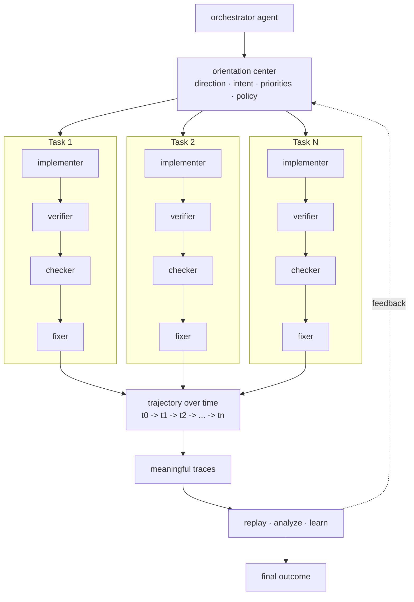

# Multi-Agent Orientation Layer

Status: **architecture map / positioning bridge**.

Multi-agent execution produces outputs. Multi-agent orientation preserves
direction, lineage, and temporal route memory.

This document gives LS a compact external frame for the next step after ordinary
multi-agent orchestration:

```text
execution -> output
orientation -> direction + lineage + replayable trajectories + better next route
```

## Core thesis

When hundreds of agents collaborate, the hard problem is not only assigning work.
The hard problem is preserving a shared center of direction while the work unfolds
over time.

LS treats agent work as route-bearing cooperation:

```text
task
-> role route
-> evidence
-> contribution
-> decision
-> temporal trail
-> reusable artifact
```

The claim stays narrow:

```text
models do not become magically smarter
cooperative routes become more precise when their paths are preserved and reused
```

## Why execution alone is not enough

A standard multi-agent workflow can fan out into many implementers, verifiers,
critics, fixers, and tools. That creates useful throughput, but it does not by
itself answer the questions an operator, reviewer, or future agent needs:

- What direction was the system trying to preserve?
- Which route produced the useful result?
- Which traces were meaningful rather than noise?
- Where did the route drift, fail, or need repair?
- Can the path be replayed, audited, and improved?
- Should the next similar task reuse this route or choose another?

Without an orientation layer, scale can produce output without lineage and speed
without accountability.

## Architecture sketch



The orientation center is not another agent that simply gives orders. It is the
runtime center that preserves the working direction and decides which traces are
important enough to become route memory.

## Standard model vs LS orientation model

| Dimension | Standard multi-agent execution | LS multi-agent orientation |
| --- | --- | --- |
| Main unit | task completion | route over time |
| Center | orchestrator | orientation center with direction, intent, priorities, policy |
| Memory | logs or chat history | replayable route memory |
| Trace handling | many raw events | meaningful traces selected for reuse |
| Learning signal | final output quality | trajectory, repair points, evidence, route reward |
| Accountability | weak lineage | who/what/why/when preserved as trail evidence |
| Next task | starts mostly from scratch | starts from the best known verified route |

## Minimal meaningful-trace contract

A trace is meaningful when it helps decide whether a route should be trusted,
repaired, replayed, or reused.

A minimal trace record should be able to answer:

```text
task_id
route_key
agent_role
actor_id
parent_trace_id
time_index
action_summary
evidence_refs
decision
failure_or_repair_signal
contribution_signal
replay_pointer
reuse_decision
```

This keeps the system focused on reviewable cooperation rather than collecting
every possible event.

## Relationship to existing LS layers

| LS surface | Orientation role |
| --- | --- |
| Cognitive Trail Run | smallest durable route artifact |
| Cognitive Trail Network | remembers which trails worked |
| Cooperative Precision Metrics | measures whether a route became more precise |
| Contribution Ledger | attributes verified value inside the route |
| Evidence/action gate | blocks unsupported continuation, memory, or action |
| OrientationCenter | preserves direction through the decision cycle |
| Human Operator | owns goal, consent, boundary, and acceptance test |

## Public positioning

Short form:

```text
Multi-agent teams need more than execution. They need orientation.
```

Expanded form:

```text
At scale, agents need a center for direction, intent, and traces over time.
Those traces become trajectories agents can replay, analyze, and learn from.
Otherwise we get output without lineage and scale without accountability.
```

LS gives this claim an implementation surface: route memory, evidence gates,
contribution accounting, replayable artifacts, and operator approval.

## Non-claims

This layer does not claim that:

- agents become generally self-improving;
- model weights are updated;
- every workflow is safe by default;
- route rewards are proof of truth;
- human review can be removed.

The narrower claim is enough:

```text
preserved route trajectories can make repeated cooperation more precise
```

## Next engineering steps

1. Add a small before/after demo: standard execution vs orientation-guided route.
2. Extend one PR-review trail example with explicit `trajectory_over_time` fields.
3. Add a deterministic replay report that shows where the route was repaired.
4. Add a reviewer-facing screenshot/SVG once the diagram stabilizes.
5. Keep the public language precise: orientation improves route memory, not model intelligence.
