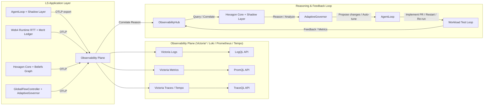

# OBSERVABILITY_STACK_LS.md
**Версия:** 0.1 (адаптированный черновик)
**Дата:** 18 февраля 2026
**Автор:** Главный архитектор LS

### 1. Назначение

Определить адаптированную под LS схему observability stack с замкнутым feedback loop:
**сбор → анализ → корреляция → предложения изменений → feedback → re-run**.

### 2. Целевые компоненты LS

- ObservabilityHub
- GlobalFlowController
- Hexagon Core
- AdaptiveGovernor
- Web4 Runtime (RTT + Merit Ledger)
- AgentLoop + Shadow Layer

### 3. Архитектура (Mermaid)

### 4. Ключевые адаптации под LS

#### 4.1 Источники данных

- **AgentLoop + Shadow Layer**: reasoning logs, tool calls, rollback events, human feedback (HCP).
- **Web4 Runtime**: RTT latency, queue pressure, GlobalFlow metrics, Merit Score deltas, Synergy proofs.
- **Hexagon Core**: Beliefs Graph changes, causality events, temporal index updates.
- **GlobalFlowController + AdaptiveGovernor**: backpressure events, rejection rates, limit adjustments.

#### 4.2 Observability Plane

- **OTLP** как единый вход (Rust + Python интеграция).
- **Victoria* стек** (или Loki/Prometheus/Tempo) для локального и распределённого сценария Web4 Mesh.
- Раздельные API:
  - LogQL для логов,
  - PromQL для метрик,
  - TraceQL для трейс-корреляции.

#### 4.3 Closed Loop

- Основной контур:
  **ObservabilityHub → Hexagon Core + Shadow Layer → AdaptiveGovernor → AgentLoop**.
- AdaptiveGovernor может:
  - авто-тюнить GlobalFlow limits,
  - предлагать PR-изменения через AgentLoop,
  - запускать повторные workload-прогоны для валидации.

### 5. Практическая ценность для LS

- Снижение «чёрного ящика» в Web4 Meritocracy Mesh.
- Диагностика причин деградации Merit Score и синергии.
- Корреляция task failures (RTT timeout / poisoned LoRA / reasoning fault).
- Поддержка GhostGUI Journey-визуализации полного пути задачи:
  **request → RTT → reasoning → tool call → result + metrics**.

### 6. Рекомендация по реализации (Phase 15–16)

1. Добавить OTLP exporter в Rust (`web4_runtime`) и Python (`ObservabilityHub`) — оценка 3–5 дней.
2. Запустить локальный observability стек: Victoria Logs + Victoria Metrics + Tempo (`docker-compose`).
3. Подключить PromQL / LogQL / TraceQL в ObservabilityHub.
4. Замкнуть loop: AdaptiveGovernor читает метрики (PromQL), предлагает изменения, AgentLoop применяет и перезапускает workload.

### 7. Критерии готовности (Definition of Done)

- Все 6 целевых LS-компонентов публикуют OTLP-телеметрию.
- Корреляция по trace-id работает между логами, метриками и трейсами.
- AdaptiveGovernor может применить минимум один авто-тюнинг лимитов на основе наблюдаемой деградации.
- Workload re-run фиксирует measurable improvement (latency/error-rate/throughput).
