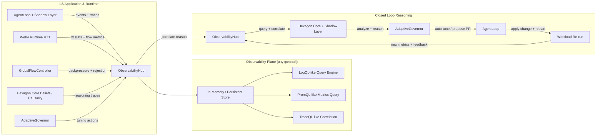

# OBSERVABILITY_STACK_LS.md
**Версия:** 0.2 (внутренний LS-only контур)
**Дата:** 18 февраля 2026
**Автор:** Главный архитектор LS

### 1. Назначение

Определить внутренний observability stack для LS без внешних платформ, с полным closed-loop reasoning контуром:
**сбор → анализ → корреляция → предложения изменений → feedback → re-run**.

### 2. Что уже есть в LS (базовые опоры)

- **ObservabilityHub** — центральный хаб событий и метрик.
- **RttStats + GlobalFlowController** — RTT, очереди, backpressure, rejection-rate.
- **Hexagon Core** — reasoning-ядро (Beliefs Graph + Causality + Temporal Index).
- **AdaptiveGovernor** — runtime-тюнинг по наблюдаемым сигналам.
- **AgentLoop + Shadow Layer** — цикл `observe → think → act → verify`.
- **Web4 Runtime** — распределённый транспорт с собственными traces/events.

### 3. Архитектура (Mermaid)

### 4. Ключевые отличия от внешних схем

- Нет внешних Victoria*/Loki/Prometheus/Tempo — наблюдаемость реализуется на внутреннем LS-контуре.
- Нет внешнего «reasoning orchestrator»: эту роль выполняют **Hexagon Core + Shadow Layer**.
- ObservabilityHub расширяется до query-поверхности (LogQL/PromQL/TraceQL-подобная модель).
- В Web4 Mesh применяется fan-out событий: узлы могут локально собирать OTLP-подобные события и агрегировать в сеть.

### 5. Источники данных и сигналов

- **AgentLoop + Shadow Layer**: reasoning logs, tool calls, rollback events, HCP feedback.
- **Web4 Runtime**: RTT latency, queue pressure, flow metrics, Merit deltas, Synergy proofs.
- **Hexagon Core**: Beliefs Graph diffs, causality events, temporal index updates.
- **GlobalFlowController + AdaptiveGovernor**: backpressure events, reject-rate, limit adjustments.

### 6. Минимальный план реализации (Phase 15–16)

1. Ввести **OTLP-подобный exporter** в Rust (`web4_runtime`) и Python — оценка 3–4 дня.
2. Расширить **ObservabilityHub** до трёх query-интерфейсов (логи/метрики/трейсы) — 5–7 дней.
3. Замкнуть loop: AdaptiveGovernor читает метрики → предлагает тюнинг → AgentLoop применяет → workload re-run.
4. Добавить сквозную **trace correlation** по trace-id: `request → RTT → reasoning → tool → response`.

### 7. Definition of Done

- Все ключевые LS-компоненты публикуют OTLP-подобную телеметрию в ObservabilityHub.
- Работает единая корреляция log/metric/trace по trace-id.
- AdaptiveGovernor выполняет минимум один авто-тюнинг на реальной деградации метрик.
- Workload re-run фиксирует measurable improvement (latency/error-rate/throughput).

### 8. Следующие артефакты (по запросу)

- Структура OTLP-подобного события для LS.
- Черновик API-расширений ObservabilityHub.
- Локальный `docker-compose` для тестового стека без внешних vendor-зависимостей.
