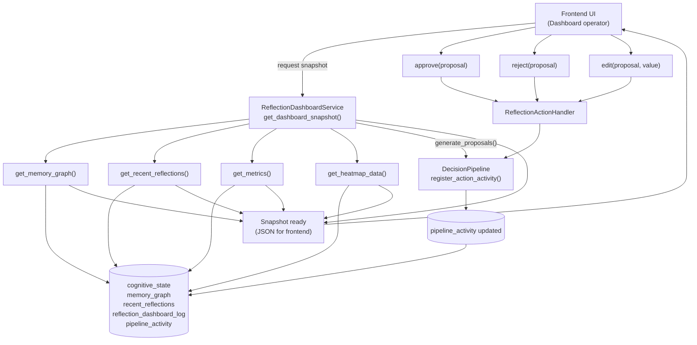

# Reflection Dashboard — Data & Action Flowchart

Ниже — готовая визуальная диаграмма в формате **Mermaid flowchart**, чтобы вставлять в документацию (GitHub/GitLab/Markdown-рендереры с Mermaid).

## Краткая интерпретация

- `get_dashboard_snapshot()` агрегирует все блоки данных и формирует единый JSON для UI.
- `approve/reject/edit` проходят через `ReflectionActionHandler`, который применяет изменения в `DecisionPipeline`.
- `DecisionPipeline.register_action_activity()` пишет события в `pipeline_activity`, что затем используется для heatmap/метрик.

## Где использовать

- `docs/` (архитектурные страницы);
- PR-описания для командного обсуждения;
- onboarding-документация операторов Reflection Dashboard.
