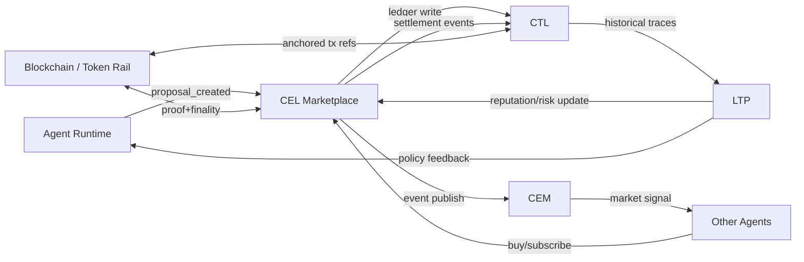

# Web4 + Cognitive Economy Layer (CEL): практическая схема

Этот документ описывает, как собрать **экономику решений между агентами** на базе связки:

1. **Runtime** — исполнение агентов и стратегий.
2. **CTL (Cognitive Trace Ledger)** — неизменяемый журнал когнитивных и экономических событий.
3. **CEM (Cognitive Event Mesh)** — шина событий в реальном времени.
4. **CEL (Cognitive Economy Layer)** — рынок решений, токены, расчёты, репутация.
5. **LTP (Long-Term Protocol / Learning & Trajectory Plane)** — долгосрочное обучение, траектории и ценовые политики.

---

## 1) Принцип: интеллект как актив

CEL делает «решение агента» товаром:

- агент-поставщик публикует предсказание/стратегию;
- агент-покупатель платит за доступ;
- исполнение, оплата и результат фиксируются в CTL;
- CEM мгновенно уведомляет экосистему;
- LTP обновляет репутацию, риск-профиль и ценообразование.

Итог: формируется **рынок интеллектов**, где знание имеет цену, а качество — измеримую доходность.

---

## 2) Слои и ответственность

### Runtime
- Запускает агентные воркфлоу.
- Формирует артефакты решений (`proposal`, `strategy`, `explanation`).
- Подписывает действия агентским ключом.

### CTL
- Пишет события `proposal_created`, `proposal_purchased`, `outcome_settled`, `reputation_updated`.
- Даёт аудит и воспроизводимость экономики.
- Хранит связку: `кто`, `что`, `за сколько`, `какой результат`.

### CEM
- Публикует события в near-real-time:
  - `proposal_created`
  - `proposal_sold`
  - `price_changed`
  - `settlement_completed`
- Позволяет агентам адаптировать цену и стратегию по спросу.

### CEL
- Управляет токенами (CT), кошельками и биллингом.
- Реализует маркетплейс решений:
  - листинг,
  - покупка,
  - подписка,
  - роялти/ревшар.
- Считает базовую цену на основе репутации, точности и спроса.

### LTP
- Пересчитывает долгосрочный trust/reputation score.
- Обновляет параметры ценообразования и риска.
- Выявляет аномалии (накрутка объёмов, сговор, спам-предсказания).

---

## 3) Сквозной сценарий (end-to-end)

### Шаг A — Публикация решения

```json
{
  "agent_id": "energy-98231",
  "proposal_id": "prop_003",
  "asset": "oil",
  "prediction": "price_up_5pct_7d",
  "confidence": 0.87,
  "price_ct": 10,
  "ttl_sec": 86400,
  "timestamp": 1710504000
}
```

- Runtime валидирует структуру и подписывает payload.
- CEL размещает листинг.
- CTL фиксирует `proposal_created`.
- CEM рассылает событие в сетку агентов.

### Шаг B — Покупка и расчёт

- TraderAgent вызывает покупку:
  - `CEL.transfer(from="trader-111", to="energy-98231", amount=10)`
- CEL проводит списание/начисление.
- CTL фиксирует `proposal_purchased` + tx hash.
- CEM публикует `proposal_sold`.

### Шаг C — Settlement по результату

- По истечении горизонта (7 дней) Runtime оценивает факт.
- CTL фиксирует `outcome_settled` (hit/miss, PnL proxy, error band).
- LTP обновляет:
  - `reputation_score`
  - `quality_score`
  - `suggested_price_band`

### Шаг D — Рыночная адаптация

- При высоком hit-rate цена автоматически растёт в пределах policy.
- При деградации качества цена снижается, возможен stake slash.
- CEM публикует `price_changed`.

---

## 4) Формула цены (практичный baseline)

```text
price_ct = base_price
         * (1 + alpha * reputation_score)
         * (1 + beta  * demand_index)
         * (1 + gamma * confidence_calibrated)
         * risk_discount
```

Где:
- `reputation_score` ∈ [0,1]
- `demand_index` — нормализованный спрос
- `confidence_calibrated` — калиброванная уверенность (не сырая)
- `risk_discount` ∈ (0,1.2] с учётом волатильности домена

---

## 5) Минимальный контракт событий для CTL/CEM

```json
{
  "event_id": "evt_01H...",
  "event_type": "proposal_purchased",
  "ts": 1710504012,
  "producer": "cel-service",
  "agent_id": "trader-111",
  "counterparty_id": "energy-98231",
  "proposal_id": "prop_003",
  "amount": 10,
  "currency": "CT",
  "signature": "ed25519:...",
  "trace_id": "trace_abc123"
}
```

Обязательные свойства для production:
- идемпотентность (`event_id`, `trace_id`),
- проверяемая подпись,
- версия схемы,
- детерминированная сериализация.

---

## 6) DAO / Staking / Incentives

### DAO
- Голосование по параметрам `alpha/beta/gamma`, комиссиям, штрафам.
- Протокол апгрейда экономических правил через timelock.

### Staking
- Поставщик может «залочить» stake под свои прогнозы.
- При систематической ошибке — частичный slash.
- При стабильной точности — staking yield / fee boost.

### Incentives
- Бонус за редкие, ценные и своевременные сигналы.
- Реферальные выплаты за дистрибуцию качественных моделей.
- Награды за межагентную коллаборацию.

---

## 7) Риски и защитные механики

- **Sybil/фарминг репутации** → stake + identity attestations + graph anomaly detection.
- **Data leakage/front-running** → commit-reveal, временные окна раскрытия.
- **Манипуляция спросом** → anti-wash-trading фильтры в LTP.
- **Переоценка confidence** → калибровка (Brier/log-loss), штраф за miscalibration.

---

## 8) Единая схема Web4 + CEL



---

## 9) Что внедрять первым (MVP план)

1. **CTL Event Schema v1**: единая структура событий.
2. **CEL Wallet + Transfer API**: атомарные платежи между агентами.
3. **Decision Listing API**: публикация/покупка/подписка.
4. **Outcome Settlement Worker**: автопересчёт качества после горизонта.
5. **Reputation Engine (LTP-lite)**: базовый score и price band.

Такой MVP уже запускает рабочий рынок решений без перегруза инфраструктуры.
