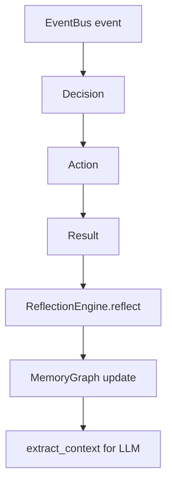

# LS Cognitive Loop: Reflection Engine + Agent Memory Graph

## Overview

This module implements a continuous cognitive runtime loop:

`event -> decision -> action -> result -> reflection -> memory graph update`

The loop enables LS agents to:
- store experiences as graph memory,
- compare previous and current states,
- compute progress,
- generate self-reflections,
- persist learned insights for future reasoning.

## Architecture

## Components

### Memory Layer (`python/ls/memory/`)
- `node.py`: `MemoryNode` (`fact|event|decision|action|goal|reflection|knowledge|agent_state`)
- `edge.py`: `MemoryEdge` (`caused_by|leads_to|related_to|derived_from|part_of|improves|worsens`)
- `memory_graph.py`: graph API (`add_node`, `add_edge`, `get_node`, `get_neighbors`, `find_path`, `semantic_search`, `extract_context`)
- `graph_store.py`: JSON persistence (`JsonGraphStore`)
- `query_engine.py`: query helpers over graph

### Cognition Layer (`python/ls/cognition/`)
- `state_tracker.py`: `AgentState`, `StateTracker`
- `reflection_engine.py`: state comparison, progress scoring, reflection generation, graph update, EventBus integration

## Progress Evaluation

Default scoring:

`progress = current.goal_completion - previous.goal_completion`

Interpretation:
- `> 0`: improvement (`improves` edge)
- `= 0`: neutral
- `< 0`: regression (`worsens` edge)

## EventBus Integration

`ReflectionEngine` subscribes to:
- `decision_made`
- `tool_executed`
- `action_result`

Every event creates/updates state and (when previous state exists) appends reflection memory.

## LLM Context Extraction

Use `MemoryGraph.extract_context(node_id, depth=2)` to get:
- connected `nodes`
- traversed `edges`
- `summaries` (counts + recent reflections)

This payload can be injected into prompts as compact cognitive context.

## Persistence

`JsonGraphStore` saves graph snapshots as JSON for local default persistence.
Future backends (Neo4j/RedisGraph/ArangoDB) can implement the same load/save contract.
