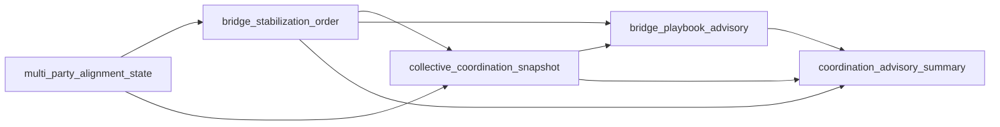

# Coordination Advisory MVP

## Problem

Before this stack, the system could already produce detailed coordination signals (state, bridges, stabilization hints, and playbook candidates), but operators and downstream consumers still had to manually interpret whether the current strategy fit the live scene.

In practice, that creates a gap:

- the system knows **what is happening**,
- it can suggest **what might help**,
- but there is no compact top-level advisory that says whether the current playbook is a good fit for the present coordination pressure.

The Coordination Advisory MVP closes that gap with a deterministic, bounded summary layer.

## Stack Layers

### 1) `multi_party_alignment_state`

Normalizes party-level tension and alignment signals into a consistent scene-state view.

### 2) `bridge_stabilization_order`

Ranks bridge edges by stabilization priority so the system has an ordered intervention path.

### 3) `collective_coordination_snapshot`

Aggregates multi-party state and bridge-level information into a single snapshot of group coordination pressure.

### 4) `bridge_playbook_advisory`

Checks how well available playbook steps support the active bridge/stabilization pattern.

### 5) `coordination_advisory_summary`

Produces one compact advisory object with bounded fields such as readiness, intervention mode, support level, and top risk driver.

## Data Flow



Short flow:

1. Scene signals are normalized into multi-party alignment state.
2. Bridge edges are prioritized into stabilization order.
3. Collective snapshot estimates current coordination pressure.
4. Bridge-playbook advisory measures support/misalignment.
5. Coordination advisory summary emits a compact top-level interpretation.

## Why This Matters

- **Human operators:** get a short, explainable summary instead of reading several intermediate objects.
- **Downstream agents/services:** can consume stable, bounded fields for routing or display without re-deriving logic.
- **Audit/review:** summaries are deterministic and traceable back to structured inputs.
- **Future handoff/policy layers:** can use advisory output as input, while policy remains explicitly outside this stack.

## Design Constraints

This MVP is intentionally constrained:

- deterministic transforms over structured inputs,
- advisory-only semantics,
- bounded output fields and short summary reasons,
- no LLM/fuzzy logic in these layers,
- no routing/control side effects,
- no automatic policy execution.

## Example

### Input story (short)

A release is approaching. Product and design are mostly aligned, operations reports elevated rollout risk, and security requests one additional hardening check. Bridges exist, but stabilization edges rank urgency around de-escalation and pacing.

### Compact advisory output

```json
{
  "coordination_advisory_label": "fragile",
  "coordination_readiness": 0.58,
  "primary_intervention_mode": "stabilization_first",
  "playbook_support_level": "medium",
  "top_risk_driver": "coordination_risk",
  "summary_reason": "scene is fragile: coordination risk is elevated and playbook grounding is limited"
}
```
