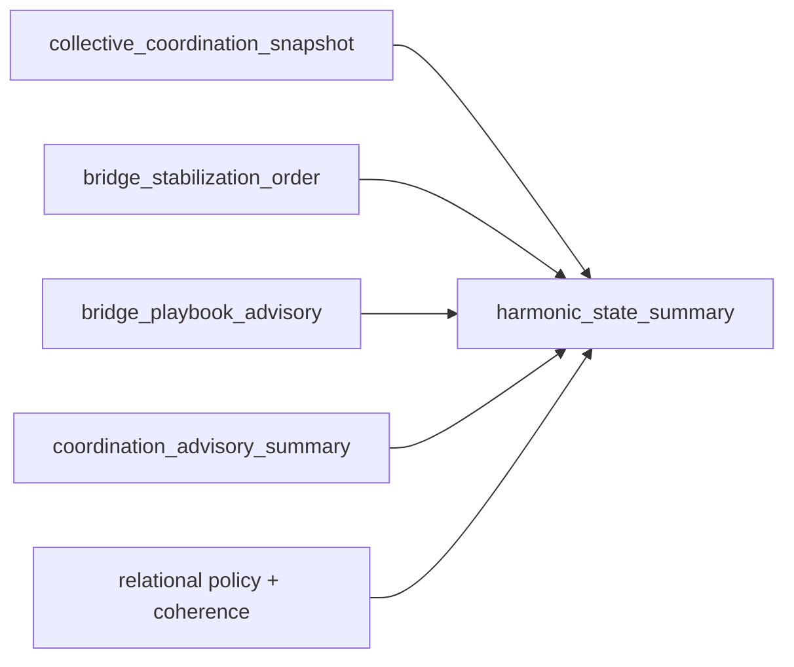

# Harmonic State Model MVP

## Problem

The coordination stack can already describe state, stabilization priority, playbook fit, and compact advisory posture. What it still cannot explain directly is the *shape* of the situation:

- is the scene merely fragile,
- is it structurally dissonant,
- is the current center still viable,
- or does the system need a guided shift into a new mode?

The Harmonic State Model closes that gap with a deterministic layer for modeling stability, dissonance, resolution, and modulation across coordination and relational signals.

## Stack Layers

### 1) `collective_coordination_snapshot`

Provides the current scene pressure: coordination risk, fragmentation, bridge type, and stabilization posture.

### 2) `bridge_stabilization_order`

Supplies the leading stabilization edge and its support strength.

### 3) `bridge_playbook_advisory`

Shows whether the available playbook actually supports the live bridge pattern.

### 4) `coordination_advisory_summary`

Compresses the scene into readiness, intervention mode, and top risk driver.

### 5) `harmonic_state_summary`

Adds one compact harmonic interpretation:

- current center,
- interval type,
- tension,
- stability,
- resolution direction,
- modulation candidate,
- one-line reason.

## Data Flow



Short flow:

1. Coordination layers estimate scene pressure and support.
2. Relational signals contribute coherence and safety posture.
3. Harmonic model translates those signals into a structural reading of tension vs. stability.
4. The result stays advisory-only and explainable.

## Why This Matters

- **Human operators:** can tell whether a scene needs calming, translation, reframing, or repair.
- **Architecture/debugging:** allows structural dissonance and false resolution patterns to be discussed explicitly instead of only via raw scores.
- **Downstream systems:** get bounded fields that are easier to display or use for diagnostics.
- **Product demos:** the layer is intuitive enough to explain complex coordination in one card.

## Design Constraints

This MVP is intentionally constrained:

- deterministic transforms over structured inputs,
- advisory-only semantics,
- bounded enums and compact reasons,
- no automatic policy execution,
- no changes to route/control decisions,
- no music-theory dependency in runtime logic beyond interval-style labels.

## Example

### Input story (short)

Product wants a release today, security wants one more hardening pass, and operations reports elevated deployment fragility. The scene is still bridgeable, but stabilization alone will not resolve the frame mismatch.

### Harmonic output

```json
{
  "harmonic_center": "stabilization",
  "harmonic_interval_label": "tritone",
  "harmonic_tension": 0.79,
  "harmonic_stability": 0.38,
  "resolution_direction": "deescalate_then_translate",
  "modulation_candidate": "translation",
  "harmonic_summary_reason": "center is stabilization; scene is structurally dissonant and points toward translation"
}
```

## Demo

Runnable demo script:

- `python scripts/harmonic_state_demo.py`

This prints a sample cross-functional release scene with coordination, advisory, and harmonic outputs together.
