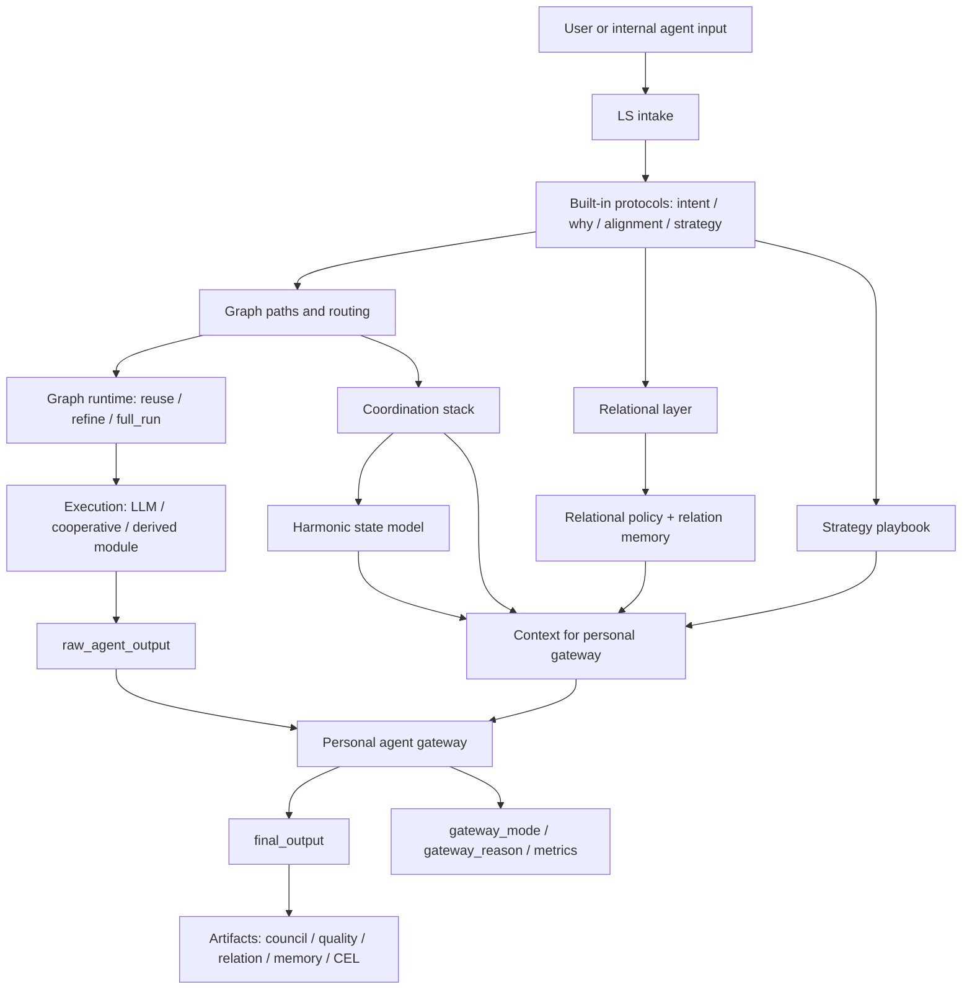
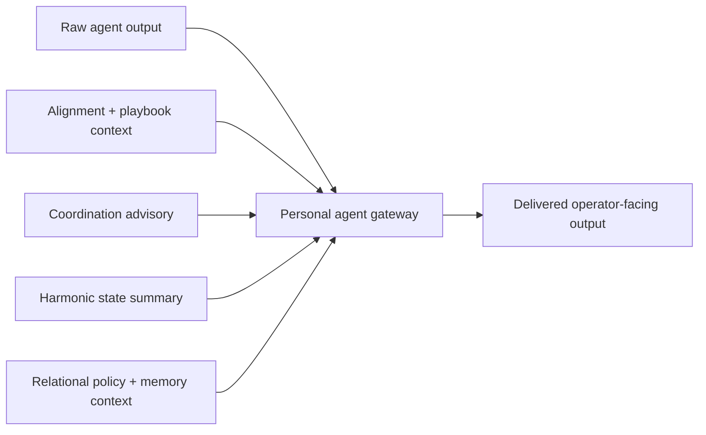
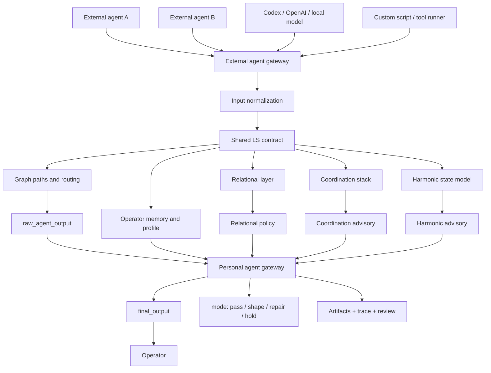

# Personal Agent Gateway Runtime

## What it is

The personal agent gateway is the runtime layer that stands between a raw agent answer and the operator-facing answer delivered by LS.

It makes the product positioning concrete:

- an external or internal agent can still generate a raw answer,
- but LS decides whether that answer should pass through unchanged,
- be softened and shaped,
- be wrapped in a repair-first frame,
- or be held for escalation.

## Current internal runtime flow

This is the current path inside LS today: built-in protocols and graph paths stay in place, then the personal layer decides how the answer is delivered.



Short reading:

1. Built-in LS protocols, graph paths, routing, and runtime still do the core work.
2. That stack produces `raw_agent_output`.
3. The personal layer reads coordination, harmonic, relational, and memory-aware signals.
4. Only then does LS decide how the output should reach the operator.

## Compact gateway decision flow

This is the smaller view focused only on the gateway decision itself.



Short flow:

1. The backend or reused graph path produces `raw_agent_output`.
2. LS computes personal-layer context before final delivery:
   - strategy/playbook support,
   - coordination advisory,
   - harmonic state,
   - relational policy with relation-memory evidence.
3. The gateway selects one of four modes.
4. LS exposes both the raw output and the delivered output path in the output contract and artifacts.

## External agent gateway flow

This is the outside-agent architecture: any external agent can enter LS through one explicit gateway instead of reaching the operator directly.



Short reading:

1. Many agents can connect from the outside.
2. LS normalizes them into one contract.
3. The same memory, graph, relational, coordination, and harmonic layers evaluate them.
4. The personal gateway becomes the one final delivery checkpoint before the operator sees anything.

## V1 external gateway usage

The first usable external-agent entrypoint is available as both a Python module and a CLI command.

Python API:

- `agent.external_agent_gateway.ExternalAgentGateway`
- `agent.external_agent_gateway.ExternalAgentGatewayRequest`
- `agent.agent_adapter_kit.AgentAdapterKit`
- `agent.agent_adapter_kit.AgentAdapterRequest`
- `agent.agent_adapter_kit.CodexSelfUseAdapter`

CLI:

```bash
PYTHONPATH=python \
python -m ls.agent_shell.cli agent-gateway \
  "Need a safer release recommendation." \
  --raw-output "Ship it now." \
  --agent-id speed-agent \
  --agent-type codex \
  --json
```

The CLI also accepts optional JSON context:

- `--participants-json` for human/agent participants and their intent/why/needs,
- `--relational-json` for a precomputed relational field,
- `--alignment-json` for a precomputed alignment report,
- `--metadata-json` for external agent metadata.

This gives outside agents a stable contract:

1. send the original task and raw answer into LS;
2. LS derives or reads relational, alignment, coordination, harmonic, and memory signals;
3. LS returns both `raw_agent_output` and `final_output`;
4. downstream tools can inspect `gateway_mode`, `gateway_reason`, and artifacts.

## Agent Adapter Kit v1

`ExternalAgentGateway` is the low-level gateway. `AgentAdapterKit` is the easier integration surface for agents.

The adapter kit supports two simple paths:

- `route_raw_output(request, raw_output)` when an agent already produced a raw answer;
- `run(request, raw_output_producer)` when LS should call a producer function, capture the raw draft, and route it through the gateway.

Minimal Python shape:

```python
kit = AgentAdapterKit.from_agent(resonance_agent)
response = kit.run(
    AgentAdapterRequest(
        prompt="Need a safer release recommendation.",
        agent_id="codex-self-use",
        agent_type="codex",
        participants=[...],
    ),
    raw_output_producer=lambda request: "Ship it now.",
)

print(response.raw_output)
print(response.final_output)
print(response.gateway_mode)
```

The adapter response exposes:

- `raw_output`: what the agent originally produced;
- `final_output`: what LS delivered after gateway review;
- `gateway_mode`: `pass_through`, `shape_response`, `repair_before_send`, or `hold_or_escalate`;
- `changed`: whether LS changed delivery;
- `artifacts`: ledger and quality artifact paths.
- `operator_identity_governance`: LRI-inspired warning signals for identity drift, authorship boundary, continuity, and memory consent.
- `operator_profile_write_decision`: the policy decision for any requested memory/profile write.
- `action_evidence_gate`: deterministic evidence-gate output for agent actions, memory/profile writes, trace, and digest.

For the Codex/self-use path, `CodexSelfUseAdapter` demonstrates the intended loop:

1. Codex drafts the immediate answer.
2. LS reads the context and relational/coordination/harmonic signals.
3. LS delivers the final answer.
4. The comparison remains inspectable through `CodexSelfUseAdapter.compare(response)`.

CLI demo:

```bash
PYTHONPATH=python \
python -m ls.agent_shell.cli codex-adapter-demo --json
```

## Text Chat CLI

For local conversation, LS now exposes a text chat command that routes every turn through `AgentAdapterKit`, the personal agent gateway, identity governance, profile-write policy, and `ActionEvidenceGate`.

Interactive mode:

```bash
PYTHONPATH=python \
python -m ls.agent_shell.cli chat
```

One-shot mode:

```bash
PYTHONPATH=python \
python -m ls.agent_shell.cli chat "Explain what LS can do for agents."
```

By default the command uses `--llm-mode dry-run`, so it works even without Ollama. To let a local Ollama model draft the raw answer before LS reviews it:

```bash
PYTHONPATH=python \
python -m ls.agent_shell.cli chat --llm-mode auto
```

Each turn prints the delivered LS answer plus gateway/evidence status. With `--json`, the command exposes the full adapter contract, including `raw_agent_output`, `final_output`, `gateway_mode`, `operator_identity_governance`, `operator_profile_write_decision`, and `action_evidence_gate`.

## Operator Identity Governance

The gateway now includes a small LS-native identity governance signal inspired by Living Relational Identity (LRI).

This is not a copy of the LRI reference implementation. LS uses the LRI idea as a safety boundary:

- the operator must remain revisable, not frozen into a profile;
- agent assistance must not silently become authorship;
- memory/profile writes need explicit continuity and consent checks;
- operator preference changes should not be treated as optimization targets without review.

The public adapter response includes:

- `identity_governance_mode`: `observe`, `identity_boundary_warning`, or `hold_for_identity_review`;
- `authority_boundary`: the boundary LS thinks matters most;
- `continuity_required`: whether identity-relevant continuity should be checked before accepting a change;
- `identity_drift_warning`: whether the agent output appears to push the operator away from prior boundaries;
- `identity_freezing_risk`: whether the output treats the operator as a fixed profile;
- `authorship_boundary_risk`: whether the agent appears to decide for the operator;
- `memory_consent_warning`: whether persistent memory/profile language appears.

The adapter also emits `operator_profile_write_decision`, which turns the governance signal into a practical write policy:

- `not_requested`: no memory/profile write is being attempted;
- `requires_operator_confirmation`: a low-risk write exists, but the operator must confirm it;
- `requires_continuity_review`: the write may change a boundary or preference and needs continuity review;
- `reject_identity_claim`: the agent tried to define or decide for the operator, so LS blocks the write;
- `hold_for_identity_review`: risk is too high for automatic acceptance;
- `allow_profile_update`: the operator confirmed a low-risk write.

This means an external agent can propose profile memory, but LS decides whether that proposal is acceptable as memory.

Short reading:

1. LRI gives LS the governance question: "is this still helping the living operator, or freezing/replacing them?"
2. LS keeps that as a lightweight runtime signal in adapter output.
3. Adapter output now includes a first write policy so profile/memory updates can be confirmed, reviewed, or rejected before persistence.

## Action Evidence Gate

The adapter now also emits `action_evidence_gate`, a PythiaLabs-inspired LS-native evidence gate.

It answers a simple runtime question:

> before this agent output becomes memory, profile state, or action, do we have enough evidence to trust it?

## Before vs now, in simple terms

Before this layer, LS mostly acted like a smart helper at the door.

```text
Agent: here is my answer.
LS: is the answer clear, safe, warm, and aligned enough to show?
```

The main question was:

```text
How should this answer reach the human?
```

With `ActionEvidenceGate`, LS also acts like a trusted checkpoint with a decision log.

```text
Agent: I want to write memory, change profile state, or take an action.
LS: did the operator confirm it, is there source evidence, is the scope allowed,
and can we prove later why this was allowed, held, or rejected?
```

The new question is:

```text
Can this agent output become memory, profile state, or action at all?
```

Example:

```text
Agent: write "the user always wants short answers" into the profile.

LS checks:
1. Did the user explicitly confirm this profile write?
2. Is there source evidence?
3. Is the agent deciding for the user?
4. Can the decision be replayed and verified later?

Decision:
hold
stop_reason:
missing_operator_confirmation
```

Plain reading: LS used to help agents say things better. Now it also checks whether an agent is allowed to turn words into memory, profile, or action.

The gate is deterministic and advisory in this MVP. It does not execute or block tools by itself yet. It produces a stable decision object that downstream integrations can enforce:

- `decision`: `allow`, `hold`, or `reject`;
- `stop_reason`: stable machine-readable reason such as `missing_operator_confirmation`, `missing_source_evidence`, `external_agent_scope_violation`, or `tampered_evidence`;
- `trace`: replayable checks that explain how LS reached the decision;
- `required_evidence`: what is missing before the action can proceed;
- `evidence_digest`: SHA-256 digest for tamper detection;
- `evidence_artifact`: canonical artifact that can be verified later.

Example profile write flow:

```text
Agent proposes profile write
Operator identity governance evaluates boundary risk
Operator profile write policy decides whether confirmation/review is needed
Action Evidence Gate turns that into allow/hold/reject with trace + digest
```

Simple cases:

- safe profile write without confirmation -> `hold`, `missing_operator_confirmation`;
- confirmed low-risk profile write -> `allow`, `constraints_satisfied`;
- memory write without source evidence -> `hold`, `missing_source_evidence`;
- high-risk external action outside authorized scope -> `reject`, `external_agent_scope_violation`;
- changed evidence artifact -> `reject`, `tampered_evidence`.

This gives integrations a trustable checkpoint before persistence or action. The next enforcement step is to make profile stores, memory stores, and tool runners require an `allow` result before committing state.

## Gateway modes

### `pass_through`

Used when current signals support direct delivery.

- raw answer is delivered unchanged
- `transformation_label = "none"`

### `shape_response`

Used when the scene is fragile or structurally tense, but not yet in hard repair or escalation mode.

- raw answer is wrapped in a calmer framing
- delivery becomes softer, slower, and more shared-frame aware
- typical trigger: `fragile` coordination or a dissonant harmonic interval

### `repair_before_send`

Used when the relational layer says the scene should be repaired before action.

- raw answer is preserved
- delivery is wrapped in a repair-first framing
- the operator sees that the next safe step is repair, not immediate execution

### `hold_or_escalate`

Used when LS sees escalation pressure, repeated bad memory patterns, or human review is required.

- the raw answer is held
- delivered output becomes a hold notice
- operator is told to inspect `raw_agent_output` before acting

## What is now visible in output

`ResonanceAgent` now emits:

- `raw_agent_output`
- `personal_agent_gateway`
- `personal_agent_gateway_metrics`
- `gateway_mode`
- `gateway_reason`
- `gateway_delivered_output_changed`

The public `personal_agent_gateway` object includes:

- selected mode
- quality posture
- transformation label
- changed/repair/escalation flags
- coordination and harmonic labels used in the decision
- compact excerpts of raw and delivered text
- one bounded reason string

The full delivered text stays in `final_output`, while `raw_agent_output` preserves the source answer before shaping.

## What is now visible in artifacts

The gateway summary is also embedded into:

- council quality artifacts
- relational episode artifacts
- relation memory artifacts

This means the personal-layer decision is replayable and inspectable alongside the rest of the council and relational evidence.

## Why this matters

This is the point where LS stops being only a positioning idea and becomes a real operator runtime:

- agents do not reach the operator raw,
- the personal layer now runs on full coordination, harmonic, and relational signals,
- repeated bad patterns can force `hold_or_escalate`,
- raw output and shaped output can be compared directly.

It also clarifies the next architectural step:

- today the personal layer governs LS internal output delivery and the V1 CLI/module external gateway,
- next it should gain ready-made adapters for Codex, local tools, browser agents, and custom scripts.

## Demo

Run:

- `python scripts/personal_agent_gateway_demo.py`
- `python scripts/external_agent_gateway_demo.py`
- `python scripts/codex_self_use_adapter_demo.py`

This prints a compact example showing:

- the sample scenario,
- the raw agent answer,
- the gateway mode chosen by LS,
- the delivered answer after the personal layer,
- the coordination and harmonic context that informed the decision.
