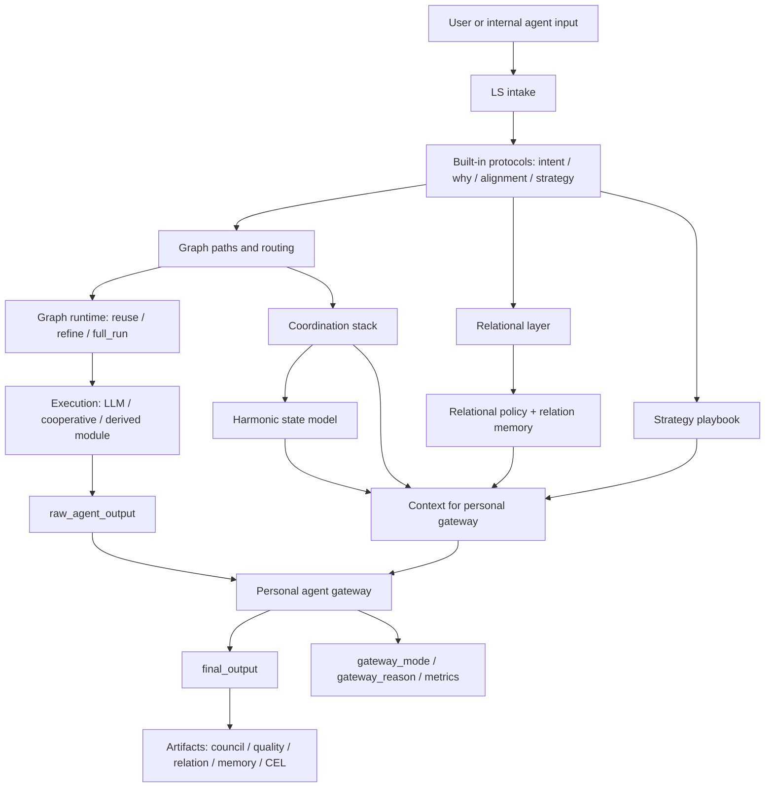
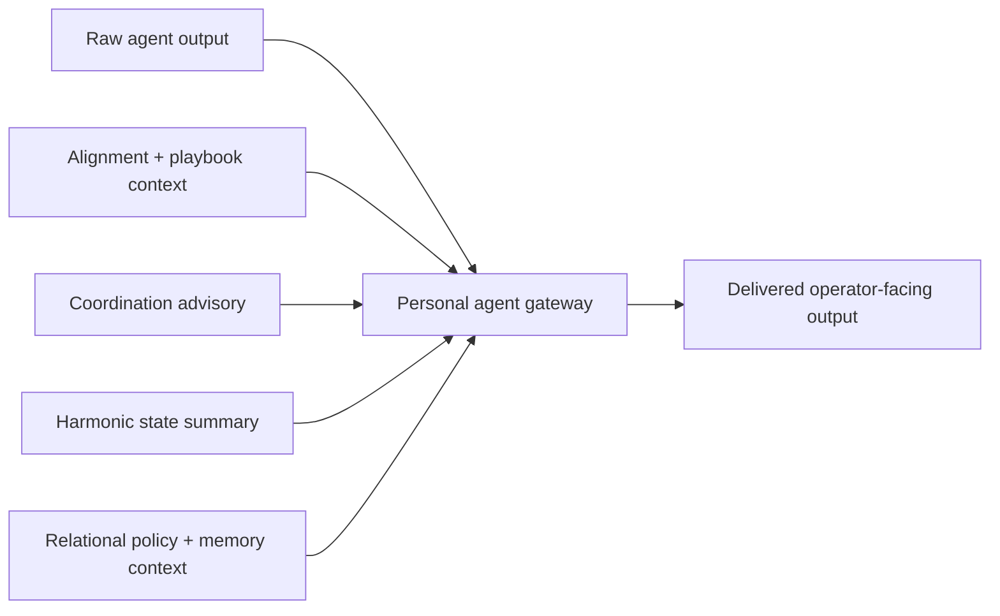
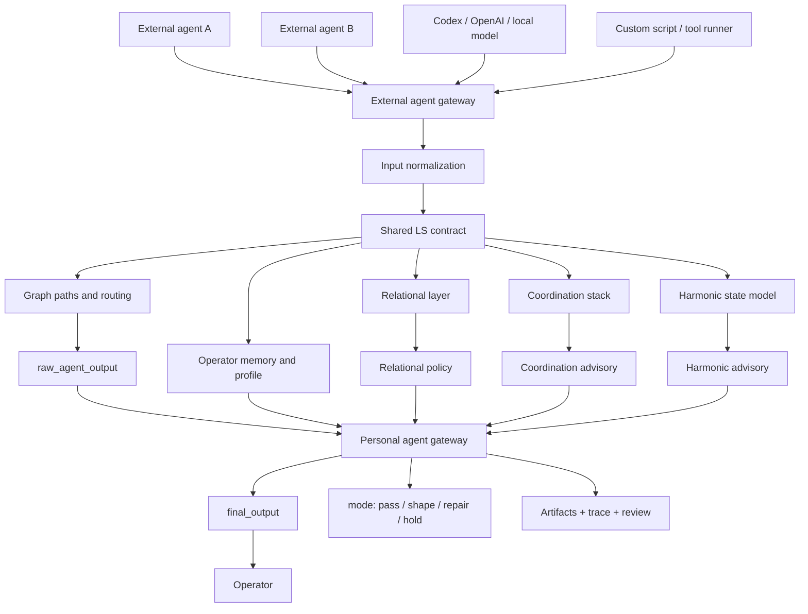

# Personal Agent Gateway Runtime

## What it is

The personal agent gateway is the runtime layer that stands between a raw agent answer and the operator-facing answer delivered by LS.

It makes the product positioning concrete:

- an external or internal agent can still generate a raw answer,
- but LS decides whether that answer should pass through unchanged,
- be softened and shaped,
- be wrapped in a repair-first frame,
- or be held for escalation.

## Current internal runtime flow

This is the current path inside LS today: built-in protocols and graph paths stay in place, then the personal layer decides how the answer is delivered.



Short reading:

1. Built-in LS protocols, graph paths, routing, and runtime still do the core work.
2. That stack produces `raw_agent_output`.
3. The personal layer reads coordination, harmonic, relational, and memory-aware signals.
4. Only then does LS decide how the output should reach the operator.

## Compact gateway decision flow

This is the smaller view focused only on the gateway decision itself.



Short flow:

1. The backend or reused graph path produces `raw_agent_output`.
2. LS computes personal-layer context before final delivery:
   - strategy/playbook support,
   - coordination advisory,
   - harmonic state,
   - relational policy with relation-memory evidence.
3. The gateway selects one of four modes.
4. LS exposes both the raw output and the delivered output path in the output contract and artifacts.

## External agent gateway flow

This is the outside-agent architecture: any external agent can enter LS through one explicit gateway instead of reaching the operator directly.



Short reading:

1. Many agents can connect from the outside.
2. LS normalizes them into one contract.
3. The same memory, graph, relational, coordination, and harmonic layers evaluate them.
4. The personal gateway becomes the one final delivery checkpoint before the operator sees anything.

## V1 external gateway usage

The first usable external-agent entrypoint is available as both a Python module and a CLI command.

Python API:

- `agent.external_agent_gateway.ExternalAgentGateway`
- `agent.external_agent_gateway.ExternalAgentGatewayRequest`

CLI:

```bash
python -m ls.agent_shell.cli agent-gateway \
  "Need a safer release recommendation." \
  --raw-output "Ship it now." \
  --agent-id speed-agent \
  --agent-type codex \
  --json
```

The CLI also accepts optional JSON context:

- `--participants-json` for human/agent participants and their intent/why/needs,
- `--relational-json` for a precomputed relational field,
- `--alignment-json` for a precomputed alignment report,
- `--metadata-json` for external agent metadata.

This gives outside agents a stable contract:

1. send the original task and raw answer into LS;
2. LS derives or reads relational, alignment, coordination, harmonic, and memory signals;
3. LS returns both `raw_agent_output` and `final_output`;
4. downstream tools can inspect `gateway_mode`, `gateway_reason`, and artifacts.

## Gateway modes

### `pass_through`

Used when current signals support direct delivery.

- raw answer is delivered unchanged
- `transformation_label = "none"`

### `shape_response`

Used when the scene is fragile or structurally tense, but not yet in hard repair or escalation mode.

- raw answer is wrapped in a calmer framing
- delivery becomes softer, slower, and more shared-frame aware
- typical trigger: `fragile` coordination or a dissonant harmonic interval

### `repair_before_send`

Used when the relational layer says the scene should be repaired before action.

- raw answer is preserved
- delivery is wrapped in a repair-first framing
- the operator sees that the next safe step is repair, not immediate execution

### `hold_or_escalate`

Used when LS sees escalation pressure, repeated bad memory patterns, or human review is required.

- the raw answer is held
- delivered output becomes a hold notice
- operator is told to inspect `raw_agent_output` before acting

## What is now visible in output

`ResonanceAgent` now emits:

- `raw_agent_output`
- `personal_agent_gateway`
- `personal_agent_gateway_metrics`
- `gateway_mode`
- `gateway_reason`
- `gateway_delivered_output_changed`

The public `personal_agent_gateway` object includes:

- selected mode
- quality posture
- transformation label
- changed/repair/escalation flags
- coordination and harmonic labels used in the decision
- compact excerpts of raw and delivered text
- one bounded reason string

The full delivered text stays in `final_output`, while `raw_agent_output` preserves the source answer before shaping.

## What is now visible in artifacts

The gateway summary is also embedded into:

- council quality artifacts
- relational episode artifacts
- relation memory artifacts

This means the personal-layer decision is replayable and inspectable alongside the rest of the council and relational evidence.

## Why this matters

This is the point where LS stops being only a positioning idea and becomes a real operator runtime:

- agents do not reach the operator raw,
- the personal layer now runs on full coordination, harmonic, and relational signals,
- repeated bad patterns can force `hold_or_escalate`,
- raw output and shaped output can be compared directly.

It also clarifies the next architectural step:

- today the personal layer governs LS internal output delivery and the V1 CLI/module external gateway,
- next it should gain ready-made adapters for Codex, local tools, browser agents, and custom scripts.

## Demo

Run:

- `python scripts/personal_agent_gateway_demo.py`
- `python scripts/external_agent_gateway_demo.py`

This prints a compact example showing:

- the sample scenario,
- the raw agent answer,
- the gateway mode chosen by LS,
- the delivered answer after the personal layer,
- the coordination and harmonic context that informed the decision.
