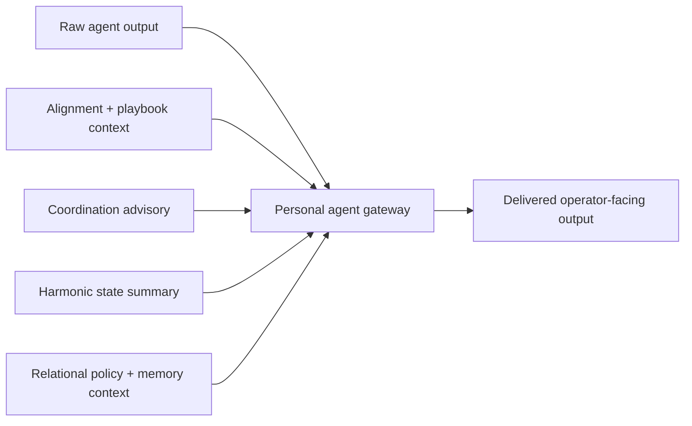

# Personal Agent Gateway Runtime

## What it is

The personal agent gateway is the runtime layer that stands between a raw agent answer and the operator-facing answer delivered by LS.

It makes the product positioning concrete:

- an external or internal agent can still generate a raw answer,
- but LS decides whether that answer should pass through unchanged,
- be softened and shaped,
- be wrapped in a repair-first frame,
- or be held for escalation.

## Runtime flow

Short flow:

1. The backend or reused graph path produces `raw_agent_output`.
2. LS computes personal-layer context before final delivery:
   - strategy/playbook support,
   - coordination advisory,
   - harmonic state,
   - relational policy with relation-memory evidence.
3. The gateway selects one of four modes.
4. LS exposes both the raw output and the delivered output path in the output contract and artifacts.

## Gateway modes

### `pass_through`

Used when current signals support direct delivery.

- raw answer is delivered unchanged
- `transformation_label = "none"`

### `shape_response`

Used when the scene is fragile or structurally tense, but not yet in hard repair or escalation mode.

- raw answer is wrapped in a calmer framing
- delivery becomes softer, slower, and more shared-frame aware
- typical trigger: `fragile` coordination or a dissonant harmonic interval

### `repair_before_send`

Used when the relational layer says the scene should be repaired before action.

- raw answer is preserved
- delivery is wrapped in a repair-first framing
- the operator sees that the next safe step is repair, not immediate execution

### `hold_or_escalate`

Used when LS sees escalation pressure, repeated bad memory patterns, or human review is required.

- the raw answer is held
- delivered output becomes a hold notice
- operator is told to inspect `raw_agent_output` before acting

## What is now visible in output

`ResonanceAgent` now emits:

- `raw_agent_output`
- `personal_agent_gateway`
- `personal_agent_gateway_metrics`
- `gateway_mode`
- `gateway_reason`
- `gateway_delivered_output_changed`

The public `personal_agent_gateway` object includes:

- selected mode
- quality posture
- transformation label
- changed/repair/escalation flags
- coordination and harmonic labels used in the decision
- compact excerpts of raw and delivered text
- one bounded reason string

The full delivered text stays in `final_output`, while `raw_agent_output` preserves the source answer before shaping.

## What is now visible in artifacts

The gateway summary is also embedded into:

- council quality artifacts
- relational episode artifacts
- relation memory artifacts

This means the personal-layer decision is replayable and inspectable alongside the rest of the council and relational evidence.

## Why this matters

This is the point where LS stops being only a positioning idea and becomes a real operator runtime:

- agents do not reach the operator raw,
- the personal layer now runs on full coordination, harmonic, and relational signals,
- repeated bad patterns can force `hold_or_escalate`,
- raw output and shaped output can be compared directly.

## Demo

Run:

- `python scripts/personal_agent_gateway_demo.py`

This prints a compact example showing:

- the sample scenario,
- the raw agent answer,
- the gateway mode chosen by LS,
- the delivered answer after the personal layer,
- the coordination and harmonic context that informed the decision.
