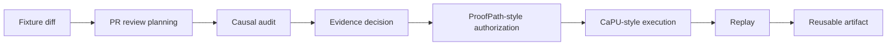

# Trusted PR Review MVP v0.2

Status: **modern-main deterministic acceptance path**  
Issue: [#696](https://github.com/safal207/LS/issues/696)  
Original product slice: [#598](https://github.com/safal207/LS/issues/598) / [PR #623](https://github.com/safal207/LS/pull/623)

## Why v0.2 exists

The original Trusted PR Review MVP already proved an end-to-end local product slice with planning, routing, causal audit, evidence, authorization, commit-before-effect, replay, and reusable artifacts.

Since then, LS merged smaller modern-main contracts with clearer boundaries:

- Orientation Triad v0.1;
- Recognition Gate v0.1;
- Recognition-to-Evidence handoff v0.1;
- Evidence Gate v0.1;
- Portable Authorization Bundle v0.1;
- Commit-Before-Effect Gate v0.1;
- Outcome Verification Center v0.1;
- Replay and Event Persistence v0.1.

v0.2 composes those exact evaluators and reference controllers into a new one-command acceptance path without removing or silently changing the original v0.1 runner.

## One command

```bash
python scripts/run_trusted_pr_review_v0_2.py
```

Generated evidence is written to:

```text
artifacts/trusted-pr-review-mvp-v0.2/
```

Run one scenario:

```bash
python scripts/run_trusted_pr_review_v0_2.py \
  --scenario allow_verified
```

## Modern chain

```text
git diff
  -> Orientation Triad
  -> Recognition Gate
  -> Recognition-to-Evidence handoff
  -> Evidence Gate
  -> Portable Authorization Bundle
  -> offline bundle verification
  -> Commit-Before-Effect
  -> harmless idempotent review-result effect
  -> Outcome Verification Center
  -> append-only event stream
  -> replay / checkpoint
  -> reusable review artifact
```

## Before and after

### Original MVP



### v0.2 acceptance chain


The central difference is that successful execution is no longer the final claim. The observed effect must also pass an independent outcome-evidence contract before the run becomes `VERIFIED`.

## Frozen scenarios

| Scenario | Terminal result | Protected effect | Replay |
|---|---|---:|---|
| `allow_verified` | `VERIFIED` | exactly one | `ADMISSIBLE / COMPLETE` |
| `hold_pending_evidence` | `HOLD` | none | `ADMISSIBLE / PARTIAL`, resumable |
| `block_broken_lineage` | `BLOCK` | none | `REJECTED / INVALID` |
| `block_expired_authorization` | `BLOCK` | none | `REJECTED / INVALID` |

### `allow_verified`

All candidate, context, policy, evidence, causal, scope, expiry, and nonce bindings match. The portable bundle verifies offline. The execution controller durably persists `COMMITTED`, writes one local review-result file, and the Outcome Verification Center receives two independent observations of the resulting state digest.

### `hold_pending_evidence`

The evidence verifier remains pending. No authorization bundle is built, no execution journal is opened, and no protected directory contains an effect. Replay exports a valid partial checkpoint.

### `block_broken_lineage`

The evidence request carries invalid causal lineage. Evidence Gate returns `BLOCK`; later stages are not attempted.

### `block_expired_authorization`

Evidence is sufficient, but the bound authorization intent is already expired at issuance time. Bundle creation fails closed with `AUTHORIZATION_EXPIRED`; the protected effect remains absent.

## Five-minute reviewer walkthrough

1. Open `fixtures/trusted-pr-review/sample.diff` and verify that the input is harmless and deterministic.
2. Open `fixtures/trusted-pr-review/scenarios-v0.1.json` and inspect the four expected terminal outcomes.
3. Run `python scripts/run_trusted_pr_review_v0_2.py`.
4. Open `artifacts/trusted-pr-review-mvp-v0.2/run-report.json` and confirm `passed: true`.
5. Confirm `protected_effects_written` equals `1` across all four scenarios.
6. Inspect `allow_verified/protected/`; it contains exactly one effect file.
7. Confirm the three non-verified scenarios have no protected effect file.
8. Inspect `allow_verified/trusted-pr-review-artifact.json` for route, contributions, evidence, authorization, execution, outcome, replay, and integrity sections.
9. Inspect each `events/trail.jsonl`; sensitive keys are redacted and each event is hash chained.
10. Confirm every replay result reports zero model, tool, and effect calls.

## Security invariants

1. Model output is never authorization.
2. Recognition and Evidence `ALLOW` do not authorize execution.
3. A portable bundle must verify offline before commit eligibility.
4. No effect occurs before durable `COMMITTED` state.
5. The effect permit is bound to one action digest and idempotency key.
6. Outcome verification does not create retroactive execution authority.
7. HOLD and BLOCK never write a protected effect.
8. Expired authorization fails before execution.
9. Replay never reruns a model, tool, authorization, or effect.
10. Sensitive fixture fields are redacted from the durable event stream.

## Generated files

The successful scenario contains:

```text
allow_verified/
  authorization-bundle/
    manifest.json
    decisions.jsonl
    hash-chain.json
    privacy-report.json
    README.md
    verifier-result.json
  internal/execution-journal.json
  protected/*.effect.json
  events/trail.jsonl
  trusted-pr-review-artifact.json
  review-summary.md
  scenario-result.json
```

HOLD and BLOCK scenarios contain diagnostics, event evidence, and summaries, but no protected effect or reusable success artifact.

## Compatibility boundary

The original command remains available:

```bash
python scripts/run_trusted_pr_review.py --scenario all
```

v0.2 is additive. It does not rewrite the bytes or historical evidence of PR #623.

## Non-claims

This is a deterministic local reference workflow. It does not claim:

- live LLM code-review quality;
- complete SAST, dependency, or secret scanning;
- production repository mutation;
- production payments or deployments;
- universal distributed exactly-once delivery;
- regulatory certification;
- proof that an approved code change is bug-free;
- adoption or endorsement by external ecosystem projects named in historical design discussions.
