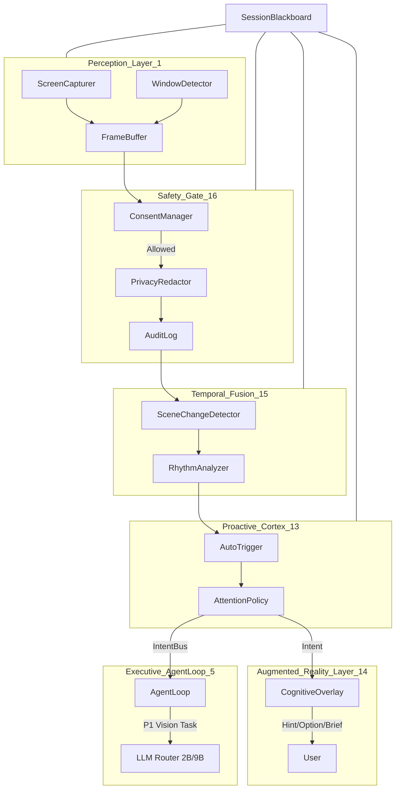

# Vision Subsystem v2: The Seeing Ghost

The Screen Perception Subsystem v2 transforms GhostGPT into a JARVIS-level colleague by providing continuous, proactive visual awareness of the user's workspace.

## Architecture Diagram

## Key Components

### 1. Perception Event Bus & Cortex Intent Bus
- **PerceptionEventBus**: Handles low-level events like `FrameCaptured` and `SceneChange`.
- **CortexIntentBus**: Handles high-level intentions like `StartObserve` (triggering deep analysis).

### 2. Temporal Fusion (Layer 15)
Uses a 3-channel detector to analyze screen changes:
`scene_score = 0.45 * pHash_delta + 0.35 * (1 - SSIM) + 0.20 * OCR_delta`

The **RhythmAnalyzer** classifies activity into modes: `Presentation`, `Discussion`, or `Coding`.

### 3. Proactive Cortex (Layer 13)
- **AttentionPolicy**: Manages the attention budget (max requests per minute) and decides when to escalate from Qwen-2B to Qwen-9B.
- **AutoTrigger**: Decides when Ghost should proactively "look" based on scene changes or user confusion.

### 4. Augmented Reality Layer (Layer 14)
Delivers three levels of visual feedback:
- **Hint**: Short TTL (8s) unobtrusive suggestions.
- **Option**: 2-3 specific choices for the user.
- **Brief**: Detailed summary upon request or high-value trigger.

All ARL outputs include `grounding_refs` to link the suggestion back to specific visual evidence.

### 5. Consent & Safety Gate (Layer 16)
- **PrivacyRedactor**: Automatically masks PII (emails, phones, etc.) before any data is sent to the models.
- **ConsentManager**: Enforces allowlists/denylists for specific applications (e.g., masking 2FA or password managers).
- **AuditLog**: Provides full transparency by logging what the system has "seen".
