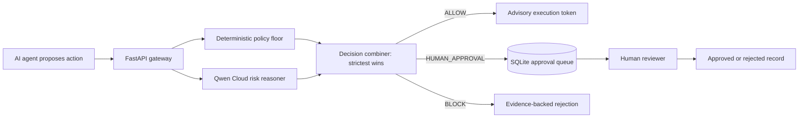

# Architecture

## Trust boundary

- Qwen provides semantic risk reasoning, not execution authority.
- Deterministic policy can only make the result stricter.
- Model failure becomes `HUMAN_APPROVAL`, never silent success.
- The MVP records approval decisions but deliberately does not execute destructive tools.
