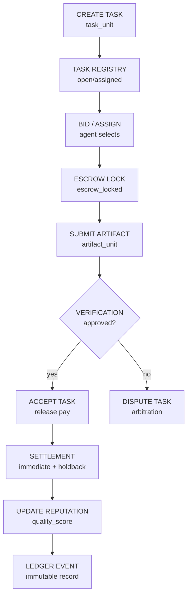

# Market Layer MVP (FastAPI + SQLite)

Минимальный рабочий скелет для цикла:

`task -> artifact -> verification -> settlement`

## Структура

- `app/main.py` — FastAPI endpoints
- `app/models.py` — SQLAlchemy модели (Agent/Task/Artifact/LedgerEvent)
- `app/schemas.py` — Pydantic API-схемы
- `app/crud.py` — бизнес-операции
- `app/ledger.py` — append-only запись событий
- `app/escrow.py` — escrow + holdback logic
- `app/reputation.py` — обновление репутации агента
- `db/database.py` — SQLite engine + session

## Запуск

```bash
cd market_layer_mvp
python -m venv .venv
source .venv/bin/activate
pip install -r requirements.txt
./run.sh
```

Документация API:

- Swagger UI: `http://localhost:8000/docs`

## Пример сценария

1. Создать агента: `POST /agents`
2. Создать задачу: `POST /tasks`
3. Подать ставки: `POST /tasks/{id}/bids`
4. Назначить исполнителя: `POST /tasks/{id}/assign`
5. Сдать артефакт: `POST /tasks/{id}/deliver`
6. Верифицировать: `POST /tasks/{id}/verify`
7. Принять или открыть спор: `POST /tasks/{id}/accept` / `POST /tasks/{id}/dispute`
8. Посмотреть ledger: `GET /ledger`

## Market Layer MVP Flow



Ключевые идеи flow:

- `Task Registry` удерживает жизненный цикл `open -> assigned -> delivered -> verified -> accepted`.
- `Escrow` блокирует reward до завершения проверки.
- `Verification` ветвится в `accept` или `dispute`.
- `Settlement` разделяет выплату на immediate payout и holdback.
- `Reputation` обновляется на основе качества доставленного артефакта.
- `Ledger` фиксирует экономические события как append-only историю.


## Позиционирование и статус

- Детальное позиционирование MVP, закрытый scope и roadmap следующей итерации: `docs/MARKET_LAYER_MVP_STATUS_RU.md`.
- Коротко: текущая версия закрывает базовый экономический цикл и готова как baseline для следующей фазы (Settlement Scheduler + Verification v2).

## Что уже покрыто

- Статусы задачи: `open/assigned/delivered/verified/accepted/disputed/closed`
- Escrow lock на старте задачи
- Holdback (20%) при acceptance
- Обновление репутации агента на базе `quality_score`
- Ledger events для ключевых действий
- Bid API (`/tasks/{id}/bids`) и запись bid-событий
- Dispute endpoint (`/tasks/{id}/dispute`)

## Что добавить следующим шагом

- `T+7/T+30` scheduled settlements
- Peer review слой + dispute endpoints
- Bids/auction scoring
- Treasury per project
